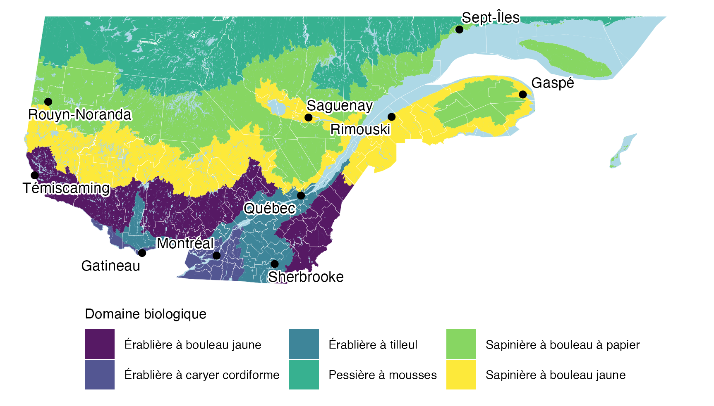

<!-- IMPORTANT -->

<!-- NOTE ../../posts/ref_blg.bib should be ../ref_blg.bib in final product-->

<!-- NOTE ../../posts/evolution.csl should be ../evolution.csl in final product-->

## Six milliards de solitudes, ça fait beaucoup

Les chiffres en lien avec la biodiversité (appelé aussi « biodiv » pour les intimes) sont stupéfiants. Par exemple, les estimations du nombre d'espèces varient selon la source : allant de quelques millions—la référence <a href='https://www.checklistbank.org' target='_blank'>ChecklistBank</a>, catalogue plus de 2.2 millions d'organismes sur la terre—à plusieurs milliards! Un article propose même un potentiel de six milliards d'espèces (🤯), en excluant les virus [@larsenInordinateFondnessMultiplied2017].

Selon cette dernière source, le nombre d'espèces *formellement décrites* serait actuellement environ 1.5 million. Le ratio de ce nombre d'espèces par rapport au nombre hypothétique total d'espèces (entre un à six milliards) est d'entre `r round(1.5e6/1e9*100, 2)` % et `r round(1.5e6/6e9*100, 2)` % respectivement. Ainsi, selon ces estimations, nous ne connaîtrions que moins de 0.2% de tous les organismes avec qui nous partageons notre unique planète habitable. Imaginez l'ampleur de la tâche. Les scientifiques ont besoin de tout le monde pour au minimum observer où se retrouvent toutes les espèces. Et la science citoyenne est un moyen pour aider les scientifiques à en apprendre sur notre monde biologique.

<!-- Toute cette vie qui a survécu de manière ininterrompue depuis au moins 3.5 milliards d'années. -->

<!-- Et l'ensemble des populations capables de former une descendance viable forment une espèce biologique. -->

On parle bien d'espèces ici : rappelons que la biodiversité comprend aussi tous les individus au sein de ces populations ainsi que leur habitat. Mais c'est quoi la biodiversité?

<!-- LIER QUESTION?? -->

<!-- LIER QUESTION?? -->

<!-- LIER QUESTION?? -->

<!-- Pour répondre à notre question, commençons par définir la biodiversité. -->

<!-- LIER QUESTION?? -->

<!-- LIER QUESTION?? -->

<!-- LIER QUESTION?? -->

La <a href='https://www.cbd.int/convention/articles?a=cbd-02' target='_blank'>Convention sur la diversité biologique (CDB)</a> définit la biodiversité comme suit :

> Variabilité des organismes vivants de toute origine y compris, entre autres, les écosystèmes terrestres, marins et autres écosystèmes aquatiques et les complexes écologiques dont ils font partie; cela comprend la diversité au sein des espèces et entre espèces ainsi que celle des écosystèmes.

Cette diversité s'interprète par la lentille de l'évolution. En particulier, le processus de la sélection naturelle explique comment la variabilité des organismes dans les populations est intimement liée avec l'environnement : ce sont les conditions de l'environnement qui favorisent ou défavorisent certains individus (et leur génétique) à un moment donné. Mais ce ne sont pas seulement les populations qui changent puisque les individus modifient leur environnement à leur tour pour faciliter leur transmission génétique. Quand les oiseaux fabriquent un nid, ou que les castors construisent un barrage ou qu'une plante produit des fleurs invitant les bibittes à polliniser d'autres fleurs, l'objectif reste toujours de donner la meilleure chance aux gènes d'être transmis.

## Voyager avec son bagage génétique

Dans le voyage de la vie, chaque individu transporte un bagage unique : ses gènes (@fig-hirbico). Nous sommes, en quelque sorte, le véhicule pour ce bagage génétique [@Dawkins:2016vi]! Ensemble, nous ne traversons pas seulement le territoire, mais prenons aussi part à une odyssée à travers les générations. Les différences entre nos bagages ne sont pas anodines : car sans variation, l'évolution n'est pas possible.

::: {style="float: right; width: 30%; margin-top: .6em; margin-left: 1em; margin-bottom: 1em;"}
 entreprend un voyage migratoire, mais fait aussi voyager ses gènes dans la prochaine génération en se reproduisant. MOB CC BY 4.0](images/hirondelle_bicolore_cap_tourmente_2024.JPG){#fig-hirbico fig-alt="Hirondelle bicolore Cap Tourmente 2024" width="270px"}
:::

Imaginez un ensemble d'organismes tous strictement identiques. Dans ce monde étrange, aucune mutation n'est possible, ce qui empêche l'émergence de différences génétiques. Le code génétique est absolument pareil d'un individu à l'autre. Dans ce cas, contrairement à ce que nous observons actuellement, la sélection naturelle qui mènerait à l'émergence de nouvelles espèces ne peut pas fonctionner : aucun choix n'est possible entre organismes puisque tous les codes génétiques sont des clones[^1] ! Le pire serait qu'il n'y aurait même pas de potentiel d'évolution suite à de grands changements environnementaux. Cela voudrait dire qu'en temps de changements climatiques, les populations qui ne seraient même pas capables de s'adapter aux nouvelles conditions verront leur chance de persister diminuer.

[^1]: L'épigénétique pourrait être un moyen d'avoir tout de même des différences d'expressions des gènes, mais imaginons que nous n'avons même pas ce genre de variation

Heureusement, notre monde est plein de variations, les populations hébergent une diversité génétique. Autrement dit, l'évolution s'observe au niveau des populations puisqu'elles sont diversifiées. Les biologistes qui étudient l'évolution tentent d'expliquer les changements de la composition des populations à la lumière des mécanismes évolutifs. Ils se posent ce genre de questions : pourquoi certaines populations changent-elles tellement qu'elles deviennent de nouvelles espèces? Pourquoi d'autres s'éteignent-elles? Pourquoi des populations ont-elles plus de succès que d'autres? Pourquoi certaines populations préfèrent-elles plus tel environnement à un autre?

<!-- ##################################################################################### -->

<!-- Imaginez-vous à l'épicerie un samedi matin : vous êtes parmi tous ces gens qui font leurs commissions en même temps au même endroit. Vous êtes tous des êtres uniques autant par votre manière d'être, mais aussi génétiquement. Si nous pouvions séquencer tous les codes génétiques des clients de l'épicerie, incluant le vôtre, nous pourrions établir le bassin génétique de cette « population » d'individus qui font leur épicerie à ce moment. -->

<!-- Tout comme dans l'exemple précédent,  -->

À la base, la variation est génétique. La collection d'individus et leurs codes génétiques différents contribuent à un bassin génétique pour un habitat quelconque. <!-- , puisqu'ils sont tous génétiquement différents les uns des autres  --> C'est donc dans ce bassin de gènes que les individus sont sélectionnés naturellement en fonction des conditions de l'environnement. Cela détermine quel ensemble de bagages génétiques pourra voyager dans la prochaine génération. <!-- À quel point l'environnement est exigeant pour les organismes sélection naturelle est d'observer des changements génétiques au niveau des populations.  -->

Rappelons donc que la biodiversité change constamment avec les mécanismes évolutifs (voir <a href='https://evologie.netlify.app/posts/2025_03_11_evologie/evologie' target='_blank'>Qu’est-ce qui se cache sous le tapis de l’évolution?</a>). Il existe donc des conditions environnementales qui peuvent favoriser ou empêcher l'émergence de biodiversité. Si l'on regarde le nombre de taxons dans le dernier 500 millions d'années, une ligne en dent de scie montrerait des augmentations et diminutions. C'est ce que des chercheurs ont faire pour des invertébrés marins [@alroyPhanerozoicTrendsGlobal2008]. Le constat est que de la biodiversité émerge et s'éteint à des taux différents : parfois une augmentation rapide, des fois des extinctions spectaculaires et d'autres fois des stagnations. Les scientifiques ont même donné des noms aux moments de la grande histoire géologique de la vie comme les [extinctions massives](https://fr.wikipedia.org/wiki/Extinction_massive) (ou crises biologiques) et les 'explosion' de biodiversification qui sont des moments où il y a une augmentation rapide d'espèces. Par exemple, pour les animaux l'[explosion du Cambrien](https://fr.wikipedia.org/wiki/Explosion_cambrienne) et la [grande biodiversification ordovicienne](https://fr.wikipedia.org/wiki/Grande_biodiversification_ordovicienne), puis pour les plantes lors de la [diversification intense pendant le Silurien-Dévonien](https://en.wikipedia.org/wiki/Silurian-Devonian_Terrestrial_Revolution)) en sont des exemples bien connus [@fanHighresolutionSummaryCambrian2020].

<!-- De ce nombre, X sont des insectes. Comme le disait le scientifique Robert M. May [-@mayBiologicalDiversityHow1986] : -->

<!-- > Le nombre total d'espèces effectivement nommées et cataloguées est d'un peu plus d'un million. La plupart d'entre elles sont des insectes. En effet, à une bonne approximation, toutes les espèces sont des insectes ![^1] -->

<!-- [^1]: Citation originale *The total number of species actually named and catalogued is just over one million. Most of these are insects. Indeed, to a good approximation, all species are insects!* -->

<!-- (imaginez le défis collosal si on incluait les espèces fossiles ou éteintes 🦤!) -->

## Les bassins génétiques s'érodent...

Cependant, plusieurs experts sont inquiets : alors que les scientifiques n'ont même pas accès à un portrait complet des espèces vivantes actuellement sur la terre, nous en perdons à un rythme jamais enregistré de l'histoire de l'humanité.

Le rapport de la *Plateforme intergouvernementale scientifique et politique sur la biodiversité et les services écosystémiques* (IPBES), colligé par un groupe international d'experts, rapporte qu'environ 1 million d'espèces animales et végétales sont actuellement menacées d'extinction [@ipbesResumeDecideurs2016]. Au Canada, depuis les années 1970, la taille de certaines populations animales a chuté de 62% et plus de la moitié des 910 espèces étudiées ont décliné en abondance [@wwf-canadaRapportPlaneteVivante2025]. Le *Rapport Planète vivante Canada 2025* est clair [-@wwf-canada2025] :

> Le constat est qu'il y a des déclins persistants des populations d'espèces suivies depuis plus d'un demi-siècle.

La perte de biodiversité est un enjeu majeur de notre époque. Comme le rappel le rapport du Cadre mondial de la biodiversité de Kunming-Montréal [@conventiondivbioCBM2022] :

> La biodiversité est essentielle au bien-être humain, à la santé de la planète et à la prospérité économique de tous les peuples, notamment à la réalisation de modes de vie équilibrés et en harmonie avec la Terre nourricière.

En d'autres mots, nous ne pouvons pas nous passer de la biodiversité. Et sa perte est liée à la nôtre. Il semble donc impératif d'en apprendre plus sur ces êtres vivants, petits et grands.

<!-- Une des missions de [Biodiversité Québec](https://biodiversite-quebec.ca/fr/a_propos) est l'agrégation de données de biodiversités de plusieurs sources dont le Système mondial d’information sur la biodiversité <a href='https://www.gbif.org' target='_blank'>GBIF (Global Biodiversity Information Facility)</a>, le Ministère des Forêts, de la Faune et des Parcs, le Regroupement QuébecOiseaux, le Service canadien de la faune et bien d'autres.  En plus, Biodiversité Québec donne [accès aux données publiques de l'Atlas](https://biodiversite-quebec.ca/fr/documentation/acces-atlas) en langage de programmation R. -->

## Guide d'identification intégrant les données de science citoyennes

Qu'est-ce qui pourrait aider à en apprendre plus sur nos voisins et cousins animaux, plantes, champignons avec qui nous partageons l'environnement? Où débuter en tant que naturalistes en herbe? <!-- et aider des scientifiques à faire des études en conservation.  --> Pour en connaitre plus sur la vie qui nous entoure, nous avons besoin de les identifier. Et pour cela, nous avons besoin d'un guide.

Les guides d'identification contiennent une source importante d'information sur la biodiversité. Par contre, pour un débutant qui n'est pas accompagné d'un spécialiste, on peut rapidement être submergé par toutes les espèces et les nuances de ses formes. En plus, les livres d'identification sont souvent plutôt lourds à apporter dans un sac. Mais ne pas avoir de guide n'est pas une option si notre but est de connaître les organismes que nous pourrions rencontrer pour une région donnée.

Un juste milieu entre un guide complet sous forme de livre et ne pas avoir de guide pourrait être des petits dépliants avec les espèces locales les plus probables d'être observées dans un milieu. Ce dépliant serait aussi un bon point de départ pour parler de diversité lors de sorties sur le terrain avec un groupe de personnes, dont des enfants, ou pour montrer à des visiteurs curieux ce que nous observons. <!-- C'est une manière de compararer les organismes et leurs liens écologiques, etc. Bref, c'est une sorte de présentation PowerPoint de biodiversité qui vous suit. -->

Serait-il possible de faire un court guide avec des espèces souvent observées pour le Québec? Est-ce possible d'utiliser les données de présence d'espèces pour faire un dépliant de biodiversité? Comme inspiration, la collection de <a href='https://www.broquet.ca/collection/guide-eclair/' target='_blank'>Guides éclair (Broquet)</a> sur le thème de la nature ou les guides de <a href='https://www.waterfordpress.com' target='_blank'>Waterford Press</a> sont le genre de dépliant qui pourrait être fait avec les données de science citoyenne (comme <a href='https://www.inaturalist.org' target='_blank'>iNaturalist</a>). Certains dépliants ajoutent de l'information comme des cartes avec des endroits intéressants pour aller faire des observations en nature.

Un dépliant basé sur des données de science citoyenne se distingue de ceux produits par Broquet et Waterford Press de deux manières. D'abord, les espèces dans un dépliant d'une région peuvent être différentes d'une autre. Par exemple, les espèces qui se retrouvent en Gaspésie ne se retrouvent pas à Montréal comme le fou de Bassan. En deuxième lieu, si une région manque de données d'observation d'espèce, cela peut servir de point de motivation pour aller en collecter et cibler la collecte de données de science citoyenne. Avant l'effort collectif amené par la science citoyenne, l'acquisition de données de biodiversité dans les endroits peu échantillonnés aurait été une tâche monastique. Les outils et les bases de données de biodiversité, maintenant accessible, rendent ce genre de projet possible.

## Réaliser le dépliant en trois étapes

Pour réaliser ce guide sous forme de dépliant, j'utilise le langage de programmation [R](https://cran.r-project.org) puisqu'il permet de manipuler des données spatiales et de biodiversité avec des fonctions développées par une communauté de programmeur passionnée. Tout au long de cette série de billets, nous allons explorer les extensions du langage R permettant ainsi de réaliser le dépliant.

Voici mon plan pour réaliser ce dépliant. Nous allons aborder trois grands thèmes dans cette série :

1.  La **cartographie** de **zones critiques de biodiversité**,
2.  la synthèse de **listes d'espèces observées** par la science citoyenne et
3.  la construction du **guide d'identifications** avec les espèces choisies.

Dans le [prochain billet](Guide_biodiv_qc_1.qmd), nous allons apprendre comment manipuler des données spatiales avec R et faire des cartes ! La figure [-@fig-carteqc] en montre un exemple :

{#fig-carteqc fig-alt="Carte sud du Québec"}

Nous allons voir dans cette série que les données d'observation d'organismes ont une composante spatiale. Il sera plus facile de placer ces observations une fois les cartes produites!

<!-- Pour les oiseaux, des guides montrent les espèces les plus fréquemment observées dans différents groupes taxonomiques : 1. la sauvagine et les oiseaux de rivage (environ entre 45 et 60 espèces; pour ceux-ci, les femelles canards sont souvent montrées), 2. le gibier (2-4 espèces), 3. les colombes, pics, martin-pêcheurs, colibris, martinets, etc. (11-12 espèces), 4. les oiseaux de proie (12-13 espèces), 5. Les oiseaux percheurs (45-54). -->