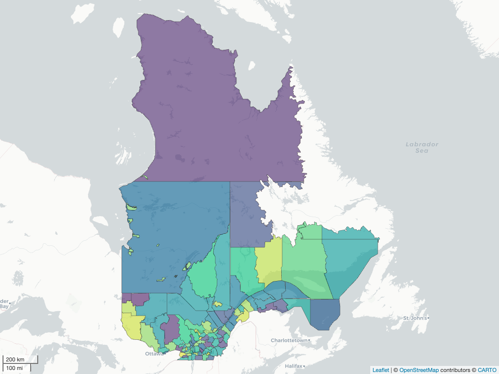
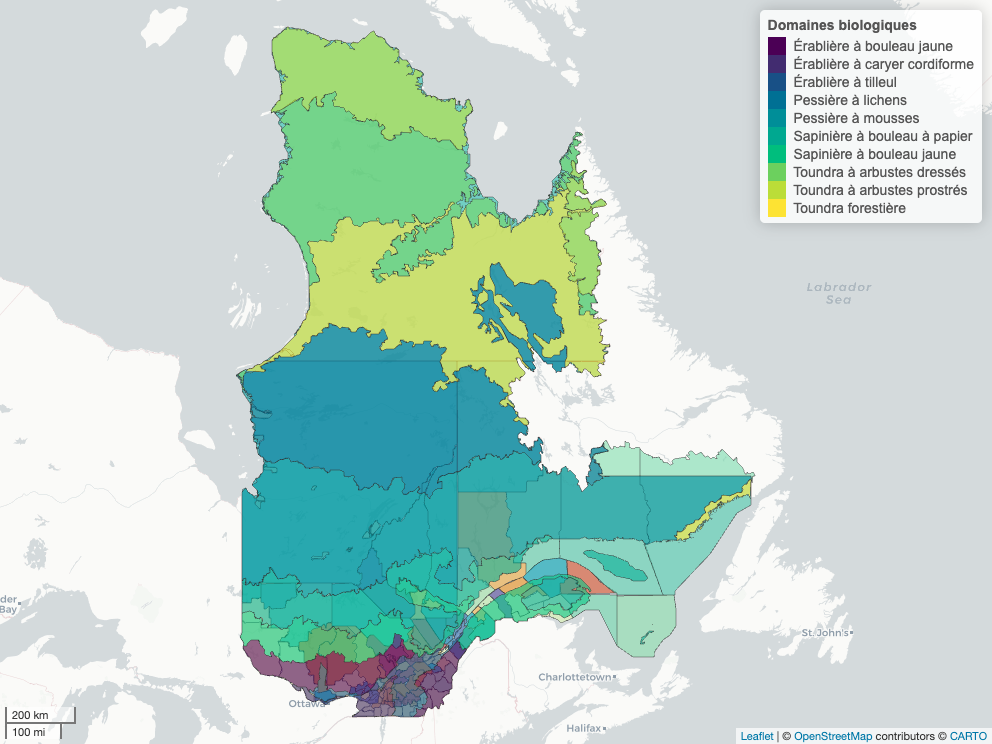
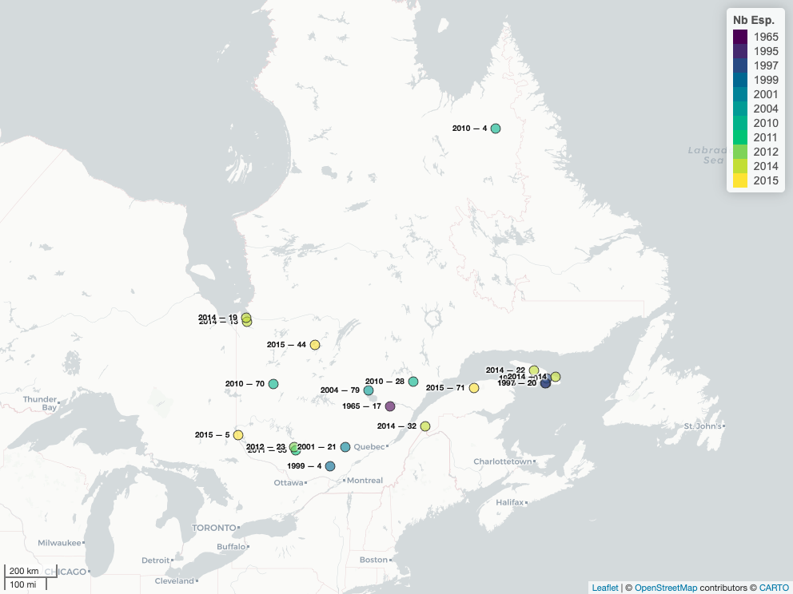
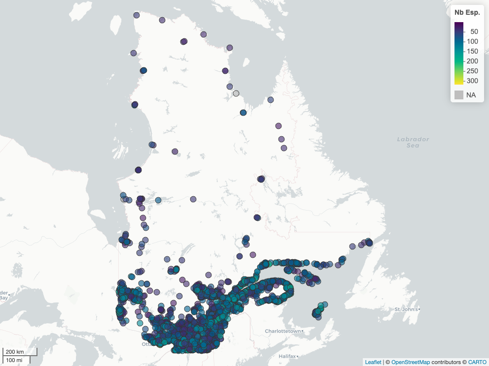
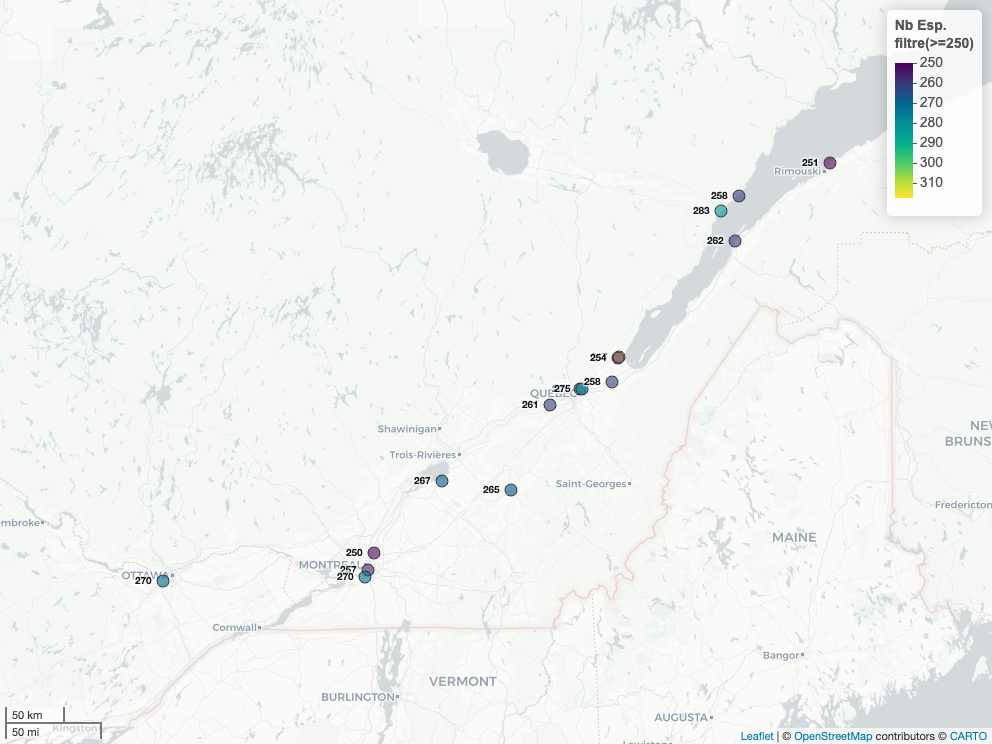
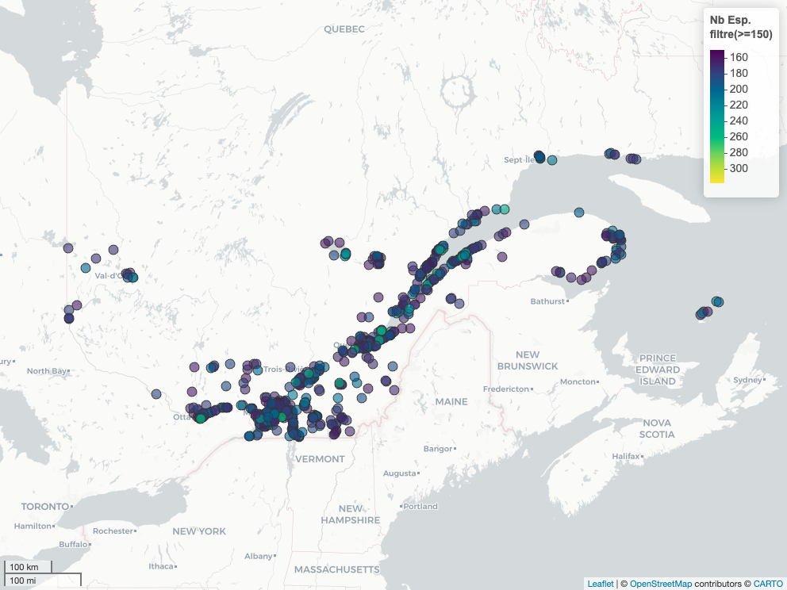
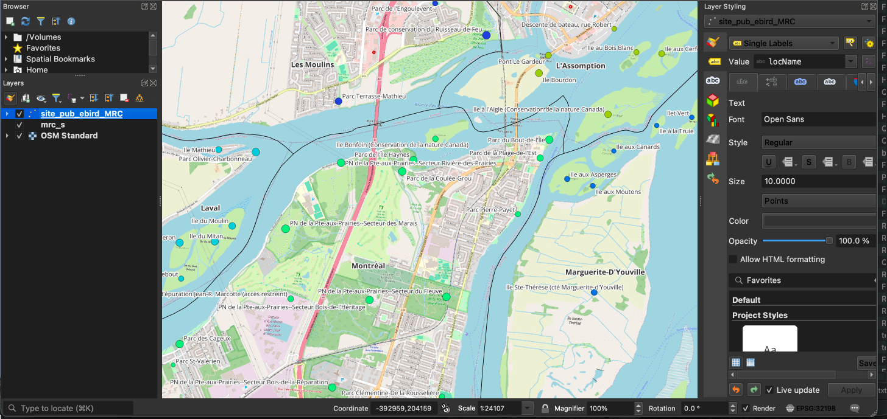
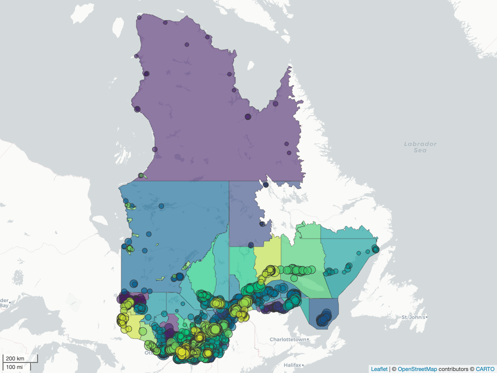
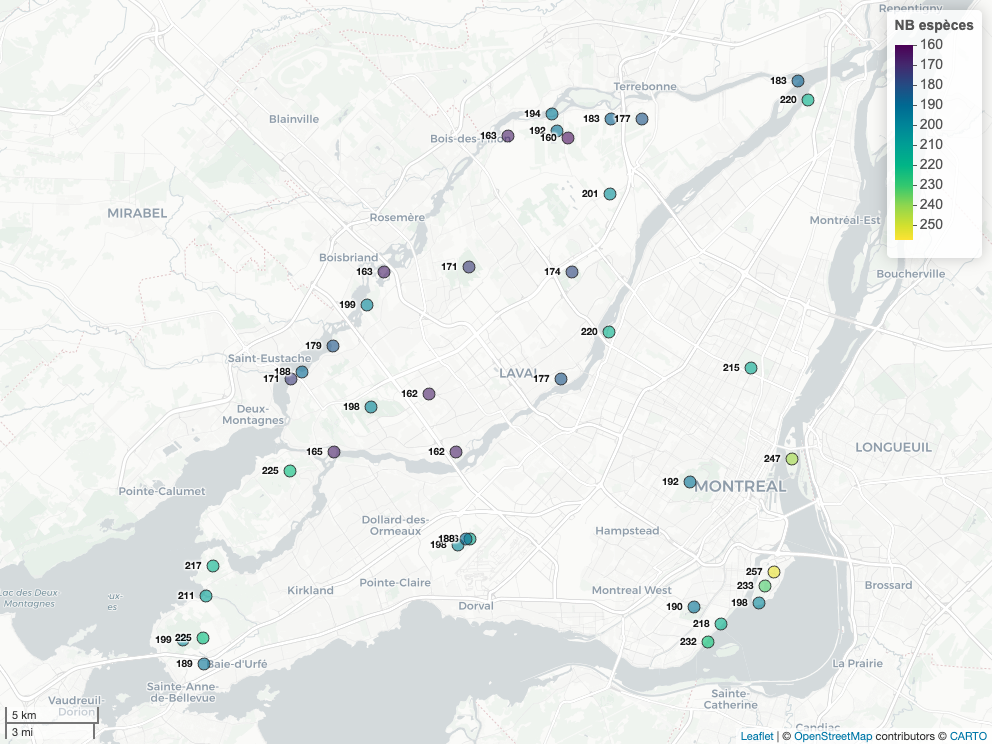

```{r variable_montre_carte_interactive, echo=FALSE}
# Mettre 'FALSE' pour une exportation rapide du blogue
# TRUE produira toutes les cartes (prend environ 6 min)
intermap_slow = TRUE # J'ai tout retiré dans plus présent... 
```

## Un guide qui s'adapte

Dans le [dernier billet](Guide_biodiv_qc_0.qmd) où nous parlions de biodiversité, nous avons terminé sur mon plan pour faire un projet permettant de représenter la biodiversité du Québec dans un dépliant. Ce guide d'identification serait basé sur les données de science citoyenne et sur des données publiques qui nous permettraient de faire des cartes.

Avant de se lancer dans ce billet, qui est un tutoriel pour faire de la cartographie dans R, voici mon plan détaillé pour ce projet.

### Plan et objectifs du projet

Pour ce projet, nous devons remplir quelques objectifs qui seront abordés lors de cette série « Guide d'identification de biodiversité du Québec » :

A)  **Cartographie et spatialisation des données**

1.1 **Cartographie de référence** : produire une carte avec les MRC du Québec et les domaines biologiques du Québec;

1.2 **Identification des zones critiques de biodiversité** : obtenir et cartographier des sites ornithologiques ayant un fort volume d'observations issues de la science citoyenne, et qui seront utilisées pour mettre en évidence des zones à haut potentiel de biodiversité;

2.1 **Inventaire des espèces observées** : élaborer, pour une région d'intérêt donnée, une liste d'espèces souvent vues par la science citoyenne ;

B)  **Contenu descriptif et visuel pour le dépliant (optionnel)**

3.1 **Liste de traits** : Compiler des informations morphologiques (longueur, envergure, poids, etc.) à intégrer aux descriptions. Selon le design du dépliant, ajouter des éléments pédagogiques comme des trucs mnémotechniques pour l'identification des oiseaux chanteurs.

3.2 **Portrait photo des organismes** : Intégrer des photos d'organismes afin d'enrichir le contenu visuel et faciliter l'identification.

La première partie de cette série commence par la cartographie (1.1 et 1.2) puisque nous allons avoir besoin de manipuler de l'information spatiale lorsque nous allons travailler avec des données de biodiversité (dans un autre billet de blogue). Plus spécifiquement, nous utiliserons des progiciels[^1] [R](https://cran.r-project.org) pour faire des analyses spatiales. J'assume ici une familiarité avec le langage R [@R-base]. Si vous voulez débuter avec le langage R, je recommande les <a href='https://r.qcbs.ca/fr/workshops/' target='_blank'>ateliers R du Centre de la science de la biodiversité du Québec</a>.

[^1]: Un progiciel est un ensemble de fonctions qui servent à accomplir des tâches. Dans R, on les mets en mémoire en éxécutant `library(base)` dans la console. Un progiciel s'installe avec la commande `install.packages("dplyr")`.

### Reproduire les analyses

Si vous voulez reproduire les analyses ou suivre le code en même temps, l'ensemble des données et les scripts de ce projet sont disponibles sur [GitHub : beausoleilmo/guide_biodiv](https://github.com/beausoleilmo/guide_biodiv). Des instructions sont présentes pour débuter avec ce projet.

<!-- [^2]. -->

<!-- [^2]: Les données sont aussi présentes sur le site [de l'Open Science Framework (OSF) : Guide d’identification de biodiversité du Québec](https://osf.io/92zv4/overview?view_only=528c78edcd814d10a7204e72fdde8490) [@MOBGuideIDBiodiv2025]. Cliquez sur les données (data.zip), téléchargez (icone de téléchargement) et décompressez le fichier. La structure des dossiers de données respecte la structure dans les scripts R. N'hésitez pas à vous pratiquer! Si quelque chose ne tourne pas rond, les commentaires sont bienvenus!  -->

Notez que les progiciels et données ont leur référence dans le fichier [`ref_blg.bib`](https://github.com/beausoleilmo/evologie/blob/7253741bf2edba6bffb354c396cd53c72c804b48/posts/ref_blg.bib) et sont cités à la fin de ce billet.

## Recherche de données

Pour réaliser le projet, nous devons trouver des jeux de données pertinents pour faire une carte et mettre des observations de biodiversité. Beaucoup de jeux de données pour de l'information cartographique administrative ou décrivant le territoire sont disponibles sur [Données Québec (DQC)](https://www.donneesquebec.ca). Pour la biodiversité, le [Global Biodiversity Information Facility (GBIF) ou Système mondial d'information sur la biodiversité (SMIB)](https://www.gbif.org) est **la** source de données la plus reconnue, en particulier pour les données de présence d'espèces Les acronymes (DQC, GBIF, etc.) seront utilisés à côté d'un jeu de données pour connaître leur source rapidement.

### Données administratives et du territoire (villes, hydrologie, etc.)

Voici les jeux de données que je propose pour faire notre carte de base (disponible sur [l'Open Science Framework (OSF)](https://osf.io/92zv4/overview?view_only=528c78edcd814d10a7204e72fdde8490)) :

-   **Régions administratives** : [Découpages administratifs (DQC)](https://www.donneesquebec.ca/recherche/dataset/decoupages-administratifs/resource/b368d470-71d6-40a2-8457-e4419de2f9c0) [@MRNFDecAdmin2018] et celles du site [Statistique Canada](https://www12.statcan.gc.ca/census-recensement/2021/geo/sip-pis/boundary-limites/index2021-fra.cfm?year=21) pour les limites du recensement du Canada (voir *Recensement de 2021 - Fichiers des limites* [@statistiquecanadaRecensement2021Fichier2025]);
-   **Hydrologie** : [Géobase du réseau hydrographique du Québec (GRHQ; DQC)](https://www.donneesquebec.ca/recherche/fr/dataset/grhq) [@MRNFGeobaseResHydro2019];
-   **Référence écologique** du Québec avec information sur les biomes : [Classification écologique du territoire québécois (DQC)](https://www.donneesquebec.ca/recherche/dataset/systeme-hierarchique-de-classification-ecologique-du-territoire/resource/b336d842-9f1d-4d0e-88c1-d771d8ade785) [@MRNFClassEcoTerritoire2016];
-   **Villes et toponymie** : Quelques données provenant du [portail de données des portraits climatiques d'Ouranos](https://portraits.ouranos.ca/fr/spatial?a=0&c=0&discrete=1&e=CMIP6&fro=1&i=tg_mean&mun=0&p=50&r=qc000&s=annual&scen=ssp370&w=0&yr=2071) pour le nom des villes et la population de celles-ci [@ouranosPlaces2024]. Par contre, la *Base de données toponymiques du Canada (BDTC)* pourrait être utilisée pour le Canada et sélectionner les villes, les parcs ou autres entités ayant un toponyme [@GouvCanRessNatCan2025]. Ce dernier jeu de données contient des règles d'affichage des étiquettes de toponymie selon l'échelle, mais nous allons pas utiliser celui-ci dans ce tutoriel.

### Données de biodiversité de science citoyenne

Pour les données de biodiversité, il existe aussi plusieurs sources. D'abord, il y a le [Global Biodiversity Information Facility (GBIF)](https://www.gbif.org) qui contient en date d'octobre 2025, plus de 43 millions de données de présences d'individus pour le Québec (vous pouvez aller voir cette information directement sur le [site web GBIF avec le filtre de région](https://www.gbif.org/occurrence/search?occurrence_status=present&gadm_gid=CAN.11_1)). Les données de biodiversité du Québec seront explorées dans la deuxième partie de cette série.

-   **Points d'observations eBird** : voir la [documentation ici](https://support.ebird.org/en/support/solutions/articles/48001009443-ebird-hotspot-faqs#anchorAllHotspots) pour accéder aux données. J'en reparlerai plus tard dans le billet;
-   **Données de présence d'espèces** : [GBIF](https://www.gbif.org) qui peuvent être accessibles directement sur le site web ou avec le [progiciel `rgbif`](https://docs.ropensci.org/rgbif/index.html) [@R-rgbif].

Aussi, il pourrait être intéressant d'avoir des informations sur la taille des organismes et autres traits morphologiques. Au lieu d'aller chercher ces valeurs individuellement, des bases de données sont déjà disponibles, pour les oiseaux [@tobiasAVONETMorphologicalEcological2022] et plus généralement pour les mammifères et les reptiles [@myhrvoldAmnioteLifehistoryDatabase2015].

-   **Traits des espèces** (optionnel) : [AVONET pour les oiseaux](https://figshare.com/s/b990722d72a26b5bfead) [@tobiasAVONETMorphologicalEcological2022] ou une [base de données des oiseaux, mammifères et reptiles](https://www.esapubs.org/archive/ecol/E096/269/) [@myhrvoldAmnioteLifehistoryDatabase2015].

Finalement, des portails de science citoyenne, comme <a href='https://inaturalist.ca' target='_blank'>iNaturalist</a>, permettent d'enregistrer des observations de la nature. Un des fondements de cette plateforme est d'avoir des preuves (photos ou enregistrement sonore) d'observation que la communauté peut identifier. Nous pourrions donc extraire des photos et finaliser notre projet de dépliant.

-   **Photos des espèces** (optionnel) : <a href='https://inaturalist.ca' target='_blank'>iNaturalist</a> avec le [progiciel `rinat`](https://github.com/ropensci/rinat) [@R-rinat].

## La cartographie

Pour cette première partie, nous allons produire deux cartes pour le dépliant :

1.  une carte couvrant l'ensemble du territoire du Québec afin d'offrir un contexte général,
2.  une carte à plus fine échelle, mettant en évidence les principaux points d’intérêt en matière de biodiversité pour les régions de Montréal et Laval.

<!-- Notre plan de match est de préparer notre session R pour avoir les progiciels et fonctions nécessaires pour faire tourner nos scripts. Ensuite, nous allons produire notre carte de fond et une carte avec des points d'observation de biodiversité. -->

<!-- À noter ici que les scripts que vous voyez sont le résultat de la recherche et non une explication de tout le développement des scripts et toutes les réflexions. -->

## Préparation de l'environnement R {#sec-prepenv}

Tout d'abord, nous devons préparer l'environnement de travail R. Une procédure détaillée est disponible sur le [projet GitHub beausoleilmo/guide_biodiv](https://github.com/beausoleilmo/guide_biodiv) dans le fichier `README.md`. En voici les grandes lignes.

```{r prep_path, echo=FALSE}
# Charge selon la position du chemin d'accès 
# Si le nom du projet n'est pas dans le chemin d'accès active, il sera changé
if (!grepl(pattern = '2025_05_24_Guide_biodiv_qc', x = getwd())) {
  # Source l'incubateur d'idées 
  source(file = 'posts/guide_biodiv_qc/2025_05_24_Guide_biodiv_qc/scripts/00_init/00_initialize.R')
} else {
  source(file = 'scripts/00_init/00_initialize.R')
}
```

L'environnement de travail a été capturé avec le progiciel `renv`, ce qui permet d'avoir les mêmes versions de progiciels R pour ce tutoriel.

```{r renv_prep, eval=FALSE, echo=FALSE}
library(renv)
# renv::init()   # création de l'espace 
renv::snapshot() # Enregistre la session actuelle
```

Pour restaurer l'environnement de travail, un fichier `renv.lock` avec l'environnement de travail reproductible permet de préparer votre session R en installant les progiciels utilisés avec les mêmes versions pour ce tutoriel. Avec le progiciel `renv`, utilisez `renv::restore()` pour recréer cet espace.

```{r renv_install, eval=FALSE, echo=TRUE}
renv::restore() # Permet de restaurer la session avec les mêmes versions
```

J'ai placé les progiciels R et autres scripts à appeler dans `00_initialize.R`.

```{r lire_prep_script, eval=FALSE}
# Lire le script de préparation automatiquement
source(file = 'scripts/00_init/00_initialize.R')
```

Celui-ci chargera les progiciels (vous devez tout de même installer les progiciels ou « *library* » avant!) et mettra en mémoire des fonctions pour faire nos analyses. La structure du fichier ressemble à cela :

```{r eval=FALSE}
# Description ------

# [...]

# Création des dossiers ------
dir.create(...)

# Progiciels R ------
library(...)

# Charge les fonctions ------
source('abcdef.R')

# [...]

```

J'ai construit le script `00_initialize.R` à mesure que je développais le projet. C'est pratique puisque pour un nouveau script, je peux simplement l'appeler (avec `source()`) et toutes les fonctions nécessaires seront à ma disposition.

Les principaux progiciels pour ce projet sont ici :

-   `ggplot2` pour faire des graphiques et des cartes [@ggplot22016; @R-ggplot2],
-   `dplyr` pour la manipulation de données [@R-dplyr],
-   `sf` pour l'analyse spatiale [@sf2023; @sf2018; @R-sf],
-   `mapview` pour faires cartes interactives simples [@R-mapview] et
-   `rgbif` [@R-rgbif] et rinat [@R-rinat] pour la manipulation de données de biodiversité.

Nous allons maintenant préparer le terrain pour faire notre carte de base.

## 1.1 Cartographie

Lorsqu'on fait des cartes, un fond permet de contextualiser l'information avec des marqueurs spatiaux (délimitation d'une région administrative, lacs ou cours d'eau importants, une ville, etc.). Aussi, les données du fond de la carte sont parfois pertinentes pour faire des manipulations spatiales. Par exemple, il arrive de recouper le territoire par des noms connus (régions administratives), de faire un sommaire en fonction de régions connues ou d'appliquer des filtres à l'échelle d'une MRC.

### Carte : régions administratives du Québec

Les délimitations des MRC du Québec sont disponibles sur Données Québec sous [Découpages administratifs (DQC)](https://www.donneesquebec.ca/recherche/dataset/decoupages-administratifs/resource/b368d470-71d6-40a2-8457-e4419de2f9c0). Le fichier qui nous intéresse est `mrc_s.shp` : ce sont les polygones des MRC du Québec. L'original est un Shapefile. Mais je trouve cela plus élégant de mettre cela en géopackage (`.gpkg`), puisque tout se retrouve dans un seul fichier. De plus, les géopackages offrent plusieurs avantages par rapport à d'autres types de fichiers comme les Shapefiles.x Le script `scripts/partie_1/Preparation_admin_region.R` montre comment.

```{r prep_donnees_adminreg, eval=FALSE}
# Fonctionne si vous téléchargez les jeux de données originaux localement. 
source(file = 'scripts/partie_1/Preparation_admin_region.R')
```

Le progiciel `sf` permet de lire des fichiers pour nos analyses spatiales [@R-sf; @sf2018; @sf2023].

```{r region_admin_qc, echo=TRUE, eval=TRUE}
# Charger le géopackage 
regqc = sf::st_read(
  # DSN : data source name
  dsn = "data/partie_1/admin_geo/admin_reg_qc/mrc_s.gpkg", 
  quiet = TRUE
) 
```

Regardons les premières lignes du jeu de données :

```{r head_reg_qc}
# Sélection de colonnes
regqc |> 
  dplyr::select(
    MRS_NM_MRC, 
    MRS_NM_REG
  ) |> 
  # Extraction de quelques lignes
  head(n = 3)
```

Il serait intéressant de voir les données sur une carte rapidement. Le progiciel [`mapview`](https://r-spatial.github.io/mapview/) est utile pour faire une carte interactive et colorier les MRC [@R-mapview]. Pour ce tutoriel, je n'ai gardé que des cartes statiques de `mapview`, mais je vous laisse tester les bouts de code comme exercice! 

```{r carte_interactive_qc_mrc, eval=FALSE}
# Faire une carte interactive.
mapview::mapview(
  x = regqc, 
  zcol = 'MRS_NM_MRC', # Les couleurs représentent les MRCs
  legend = FALSE       # Ne pas ajouter de légende 
) 
```


```{r carte_interactive_qc_shot, echo=FALSE, eval=FALSE}
# Faire la carte mais afficher plus d'information 
mv_regqc = mapview::mapview(
  x = regqc, 
  zcol = 'MRS_NM_MRC', # Les couleurs représentent les MRCs
  legend = FALSE       # Ne pas ajouter de légende 
) 
# Exportation de la carte 
mapshot2(
  mv_regqc,
  file = 'output/partie_1/carte_mv_regqc.png',
  remove_controls = c("zoomControl", "layersControl", "homeButton"), 
  delay = 2
)
# browseURL('output/partie_1/carte_mv_regqc.png')
```





Maintenant, regardons les données cartographiques qui représentent le territoire selon la nature de la végétation.

### Carte : domaines bioclimatiques

Les données de la [Classification écologique du territoire québécois (DQC)](https://www.donneesquebec.ca/recherche/dataset/systeme-hierarchique-de-classification-ecologique-du-territoire/resource/b336d842-9f1d-4d0e-88c1-d771d8ade785) vont nous donner un fond à mettre sur notre carte.

Je n'ai pas gardé le fichier complet puisque les données sont très lourdes. Le script `scripts/partie_1/Preparation_eco_region.R` prépare les données originales en un plus petit géopackage (`classification_eco.gpkg`) pour ce projet.

```{r prep_donnees_eco_reg, eval=FALSE}
# Fonctionne si vous téléchargez les jeux de données originaux localement. 
source(file = 'scripts/partie_1/Preparation_eco_region.R')
```

Les données simplifiées sont mises en mémoire avec `st_read()`.

```{r donnees_class_Eco_gpkg}
cls_eco = st_read(
  dsn = "data/partie_1/ecologie/CLASSI_ECO_QC/classification_eco.gpkg", 
  layer = 'N3_DOM_BIO', 
  quiet = TRUE
)
```

Puis nous allons utiliser le système de coordonnées ou CRS (*coordinate reference system*) de la couche de domaines bioclimatiques comme référence pour toutes les couches de notre projet.

```{r donnees_class_Eco_CRS}
# Obtenir notre CRS chouchou et l'utiliser comme base pour faire la carte 
projetCRS = st_crs(x = cls_eco)

# Ce CRS est en fait le code EPSG 32198 qui est un système de coordonnées
# projetées 'Conique conforme de Lambert du Québec' NAD83
projetCRS == st_crs(x = 32198)

# Tester si le CRS est équivalent entre des couches 
st_crs(x = cls_eco) == st_crs(x = regqc)

# On transforme le CRS de la région du Québec 
regqc_t = st_transform(x = regqc, 
                       crs = projetCRS)
```

Vous pouvez aussi exporter la représentation *Well-known Text* (WKT) du système CRS avec `st_as_text()` pour stocker l'information dans un fichier texte.

```{r ecriture_wkt, echo=TRUE, eval=FALSE}
# Écrire le WKT maitre sur lequel on peut faire référence 
writeLines(
  # Extraire le WKT comme texte seulement 
  text = st_as_text(projetCRS), 
  # Fichier de sortie pour écrire le texte (aussi appeler 'Connection') 
  con = "data/param_0/projetCRS.txt"
) 

# Lire le fichier CRS maitre  
projetCRS_read  = readLines(con = "data/param_0/projetCRS.txt")

# On peut directement utiliser ce CRS de la région du Québec 
regqc_t = st_transform(x = regqc, 
                       crs = projetCRS_read)
```

Nous pouvons superposer les cartes de régions administratives avec la classification des domaines écologiques avec `mapview()`. Vous pouvez activer ou désactiver les couches en passant votre curseur sur l'icône des couches spatiales (sous les contrôles plus et moins pour zoomer dans la carte) et en appuyant sur le bouton à bascule (boite à cocher) des couches désirées.

```{r carte_Classification_eco_superposition, eval=FALSE}
# Régions admin du QC
mapview(
  x = regqc_t, 
  zcol = 'MRS_NM_MRC', 
  layer.name = 'MRC du Québec',
  # Change la palette de couleur (voir les palettes ici `sort(hcl.pals())`)
  col.regions = hcl.colors(n = nrow(regqc_t), 
                           palette = "Spectral"),
  legend = FALSE
) +
  # Classification Écologique
  mapview(
    x = cls_eco, 
    zcol = 'NOM_DB', 
    layer.name = 'Domaines biologiques'
  )
```

```{r carte_Classification_eco_superposition_shot, echo=FALSE, eval=FALSE}
# Faire la carte mais afficher plus d'information 
mv_class_regqc = mapview(
  x = regqc_t, 
  zcol = 'MRS_NM_MRC', 
  layer.name = 'MRC du Québec',
  # Change la palette de couleur (voir les palettes ici `sort(hcl.pals())`)
  col.regions = hcl.colors(n = nrow(regqc_t), 
                           palette = "Spectral"),
  legend = FALSE
) +
  # Classification Écologique
  mapview(
    x = cls_eco, 
    zcol = 'NOM_DB', 
    layer.name = 'Domaines biologiques'
  )
# Exportation de la carte 
mapshot2(
  mv_class_regqc,
  file = 'output/partie_1/carte_mv_class_reg.png',
  remove_controls = c("zoomControl", "layersControl", "homeButton"), 
  delay = 2
)
browseURL('output/partie_1/carte_mv_class_reg.png')
```



Cette carte n'est pas vraiment belle puisque les polygones sont superposés et empêche de bien voir les détails. Nous pourrions faire une carte qui superpose les *bordures* des régions administratives sur les domaines écologiques. C'est ce que nous allons faire avec une carte statique.

### Cartes statiques

Le progiciel `ggplot2` [@ggplot22016; @R-ggplot2] a plusieurs fonctions pour ajouter des couches spatiales (par exemple `geom_sf`). Aussi, `ggplot()` ajoute les couches une par-dessus les autres : donc l'ordre dans lequel les couches sont placées pour faire la carte est important.

Pour que les cartes s'affichent correctement, il faut mettre les couches spatiales dans le même système de référence spatial ou CRS (*coordinate reference system*). Nous allons aussi utiliser `st_crs()` pour extraire le CRS d'une couche spatiale. Nous pouvons vérifier que nos couches spatiales sont dans le même CRS si `st_crs(cls_eco_simp) == st_crs(regqc)` est `TRUE` (ce n'est pas le cas dans l'exemple qui suit).

```{r verification_CRS}
# Vérification du CRS de couches spatiales (FALSE si différentes)
st_crs(x = cls_eco) == st_crs(x = regqc)    
# Ici on avait déjà transformé la couche regqc_t.
st_crs(x = cls_eco) == st_crs(x = regqc_t)  
```

Comme nous l'avons vu, la fonction `sf::st_transform()` nous permet de reprojeter une de nos couches spatiales avec le CRS d'une autre. Avant d'exécuter cette fonction, nous allons aussi simplifier nos couches spatiales. Cela peut être utile si on a des couches spatiales très détaillées qui pourraient ralentir `ggplot2`. La fonction `sf::st_simplify()` simplifie nos données spatiales et donc accélère l'affichage des cartes. À noter que la simplification n'est pas nécessaire à faire pour toutes les cartes.

Voici comment simplifier les couches spatiales et rendre le CRS identique entre 2 couches :

```{r simplify_couches}

# Pour la simplification des géométries 
# (nombre qui donne un bon résultat suite à des tests)
tolerance = 1e3

# Simplifier une forme pour faire le graphique 
cls_eco_simp = cls_eco |> 
  st_simplify(dTolerance = tolerance)

# Reprojection pour avoir le même CRS 
regqc_simp = regqc |> 
  st_simplify(dTolerance = tolerance) |> 
  st_transform(crs = projetCRS)

# Ou en utilisation le CRS d'une couche directement 
# au lieu de l'objet 'projetCRS'
regqc_simp = regqc |> 
  st_simplify(dTolerance = tolerance) |> 
  st_transform(crs = st_crs(x = cls_eco))
```

Une fois les couches dans le même système de référence, nous pouvons dessiner notre carte avec `ggplot()` et `geom_sf()`. Je place chaque couche cartographique dans son objet ce qui facilitera la construction de la carte finale. Cela permet aussi de réutiliser des couches entre les graphiques.

```{r ggplot_base}
# Faire le graphique de base ggplot 
gg_base = ggplot()
```

```{r ggplot_couches_carte_statique_qc}
# Couche de domaines bioclimatiques 
gg_cls_eco = geom_sf(
  data = cls_eco,               # Données 
  mapping = aes(fill = NOM_DB), # couleur selon les domaines biologiques
  alpha = 0.9,                  # Transparence à 90% 
  linewidth = 0                 # Pas de ligne, plus beau! 
)                

# Couche des régions administratives du Québec 
gg_reg_qc = geom_sf(
  data = regqc_simp,            # Données 
  fill = NA,                    # Pas de remplissage des polygones
  colour = 'grey100',           # Couleur des lignes
  linewidth = 0.05              # largeur fine pour les lignes
)
```

Puis on assemble les couches pour faire la carte.

```{r ggplot_carte_cls_eco_reg}
# Ajout des couches ggplot dans l'ordre voulu 
gg_qc_db = gg_base +
  # Ajout de la classification écologique
  gg_cls_eco + 
  # Ajout des régions admin, par-dessus pour voir les bordures
  gg_reg_qc
```

Notez que la couche `gg_cls_eco` est dessinée en premier et `gg_reg_qc` après. Cela permet de voir les délimitations des régions administratives par-dessus les domaines bioclimatiques. Le graphique est dans l'objet `gg_qc_db`. Notez qu'on ajoute une palette de couleur et change le thème de base pour notre carte.

```{r carte_statique_qc_affiche}
# Afficher la carte 
gg_qc_db +          
  # Change le remplissage pour la palette viridis 
  scale_fill_viridis_d(
    # Ajout d'un titre à la légende 
    guide = guide_legend(title = 'Domaine biologique')
  ) +
  # Thème minimal 
  theme_void()
```

Super! Un fond de carte pas pire pour l'ensemble du Québec! Par contre, il manque quelque chose pour s'y retrouver : l'eau et des villes.

#### Carte : hydrologie et villes

Notre carte de base manque de contexte. Plusieurs endroits au Québec sont facilement reconnaissables par leur structure hydrologique, ce qui permettrait de mieux se situer sur la carte.

La Géobase du réseau hydrographique du Québec (GRHQ) est un large ensemble de données de référence de l'hydrographie disponibles sur le site de [Données Québec (DQC)](https://www.donneesquebec.ca/recherche/fr/dataset/grhq). Nous allons seulement télécharger manuellement les données pour le sud du Québec (incluant les zones 00, 01, 02, 03, 04, 05, 06, 07_1, 07_2, 08, 14 de [l'index de téléchargement (DQC)](https://www.donneesquebec.ca/recherche/dataset/grhq/resource/4ef6703f-0ecb-46a0-bdb4-7074f00ff514)). Un script (`scripts/partie_1/Preparation_hydrologique.R`) permet de préparer les données en géopackage (`data/partie_1/hydro/grhq_sud_qc.gpkg`) pour ce projet. Lors de la préparation pour réduire la taille du fichier, j'ai appliqué un filtre pour garder les polygones de $1e6 m^2$ d'aire et plus, ce qui permet d'afficher l'essentiel des polygones pour notre carte et de réduire considérablement la taille du fichier.

```{r prep_donnees_grhq_prep, eval=FALSE}
# Fonctionne si vous téléchargez les jeux de données originaux localement. 
source(file = 'scripts/partie_1/Preparation_hydrologique.R')
```

Les données préparées sont chargées et transformées avec le même CRS du projet.

```{r charger_donnees_grhq_prep}
# Lire les données retravaillées du GRHQ
hq_filt_complete = st_read(
  dsn = 'data/partie_1/hydro/grhq_sud_qc.gpkg', 
  quiet = TRUE
) |> 
  st_transform(crs = projetCRS)
```

Aussi, nous pourrions inclure le nom de villes avec une grande population sur la carte, ce qui serait super pour visualiser les données. Le site de [portraits climatiques d'Ouranos](https://portraits.ouranos.ca/fr/) a un fichier qui nous facilitera la tâche. Nous pouvons télécharger les données directement avec le lien. Nous allons ensuite extraire certaines villes pour afficher sur la carte.

Le script `scripts/partie_1/Preparation_villes.R` prépare un fichier géopackage (`data/partie_1/villes/villes_qc_ouranos.gpkg`) que nous pouvons charger directement. Le script importe un fichier `GeoJSON` disponible sur le site d'Ouranos directement à partir d'un lien html (voir l'objet `lien_villes` dans le script de préparation). La création d'un géopackage pour ce projet permet de stocker ces données et d'y faire référence même si le serveur Ouranos change ou devient inaccessible.

```{r prep_donnees_villes_prep, eval=FALSE}
# Fonctionne si vous téléchargez les jeux de données originaux localement. 
source(file = 'scripts/partie_1/Preparation_villes.R')
```

Nous pouvons charger notre géopackage et sélectionner des villes qui nous intéresse pour mettre sur notre carte.

```{r villes_spatiales, echo=TRUE, eval=TRUE}
# Lecture du fichier des villes et populations du site d'Ouranos
villes_qc = st_read(
  dsn = 'data/partie_1/villes/villes_qc_ouranos.gpkg',
  quiet = TRUE)

# Afficher le nom des villes au besoin 
# sort(villes_qc$name)

# Vecteur avec le nom des villes 
villes_selection = c('Montréal', 'Québec', 
                     'Gatineau', 'Sherbrooke', 
                     'Saguenay', 'Trois-Rivière', 
                     "Rouyn-Noranda", 
                     'Gaspé', 'Témiscaming', 
                     'Sept-Îles', 'Rimouski')

# Extraction du nom de villes à ajouter sur la carte
villes_qc_lst_flt = villes_qc |> 
  filter(name %in% villes_selection)

```

J'ai remarqué qu'une partie du réseau hydrique de la GRHQ déborde en Ontario. Il faut donc extraire ou filtrer les données qui se retrouvent seulement au Québec. Le site [Statistique Canada](https://www12.statcan.gc.ca/census-recensement/2021/geo/sip-pis/boundary-limites/index2021-fra.cfm?year=21) permet de télécharger les limites du recensement du Canada (voir *Recensement de 2021 - Fichiers des limites*). Le script `scripts/partie_1/Preparation_admin_region.R` prépare les données dans un géopackage avec nom `can_lim.gpkg`.

```{r prep_Canada_bordure}
# Lire le fichier 
can_bord = st_read(
  dsn = "data/partie_1/admin_geo/admin_reg_can/can_lim.gpkg", 
  quiet = TRUE
)

# Extraire les limites du Québec et de l'Ontario 
qcont_bord = can_bord |> 
  # PRFNOM: Nom de la province ou du territoire, en français.
  filter(PRFNOM %in% c("Québec", "Ontario")) |> 
  # Changer le CRS 
  st_transform(crs = projetCRS) 
```

Étant donné qu'une partie du réseau hydrique est en Ontario, on fait une intersection pour « couper » les géométries selon la province (`st_intersection()`), puis on filtre pour ne garder que le nom de la province de notre choix (`filter()`).

```{r extraire_eau_qc}
# Extraction de l'hydrologie du Québec seulement
hq_filt_qc = hq_filt_complete |>
  # Intersection avec le fichier de l'Ontario et du Québec
  st_intersection(qcont_bord) |> 
  # Garder seulement ce qui se retrouve au Québec
  filter(PRFNOM == "Québec")
```

Avec cette couche filtrée, nous allons créer un objet `geom_sf()` qu'on ajoutera à la carte.

```{r carte_complete, echo=TRUE, eval=TRUE}
# Couche ggplot de l'hydrologie du Québec
gg_hq = geom_sf(
  data = hq_filt_qc, 
  linewidth = 0,
  fill = 'lightblue', # Couleur de l'eau 
  colour = 'lightblue'
)

# Ajout le point des villes 
gg_villes = geom_sf(
  data = villes_qc_lst_flt
)
```

Pour ne pas que les étiquettes des villes se chevauchent, nous allons utiliser une fonction (`geom_text_repel`) qui utilise des nombres aléatoires. Pour une reproductibilité de la carte, un point de départ est choisi pour obtenir des nombres aléatoires avec `set.seed()`. Ce point de départ (*seed*, germe ou graine aléatoire) est un nombre entier comme `12345` ou `247966138`.

```{r generateur_aleatoire_seed}
# Établir le germe aléatoire
set.seed(seed = 12345)
```

Maintenant, nous avons les informations nécessaires pour faire une carte avec :

1.  les domaines biologiques (`gg_cls_eco`),
2.  le réseau hydrique d'importance au Québec (`gg_hq`),
3.  les régions administratives (`gg_reg_qc`),
4.  les points et noms de villes sélectionnées (`gg_villes` et les étiquettes avec `geom_text_repel()`).

Notez encore une fois l'ordre des couches.

```{r ggplot_cartes_geom_simple}
# Faire le graphique de la carte 
gg_qc_db = gg_base +
  # Ajout de la classification écologique
  gg_cls_eco + 
  # Ajouter la GRHQ rognée
  gg_hq + 
  # Ajout des régions admin, par-dessus pour voir les bordures
  gg_reg_qc +
  # Ajouter le nom des villes 
  gg_villes + 
  # Ajouter les étiquettes du nom des villes 
  ggrepel::geom_text_repel(
    data = villes_qc_lst_flt, 
    # Définir les étiquettes et les coordonnées spatiales 
    mapping = aes(label = name, 
                  geometry = geometry),
    # Extraction des coordonnées spatiales pour dessiner les étiquettes
    stat = "sf_coordinates", 
    # Taille des étiquettes
    size = 3,
    # Ajout de tampon blanc pour les noms de villes 
    bg.color = "white",
    # Étendue du tampon 
    bg.r = 0.15
  )
```

La carte s'affiche avec l'objet `gg_qc_db`. Nous pouvons ensuite modifier les couleurs de la carte avec `scale_fill_viridis_d()` et sa thématique avec `theme_void()` pour partir d'une carte sans thème puis modifier l'espacement des items de la légende avec `theme()` et l'argument `legend.key.spacing.y`. La légende (voir `guide_legend()` dans `scale_fill_viridis_d()`) peut aussi être placée en bas (`position = 'bottom'`) pour laisser plus de place à notre carte.

```{r afficher_carte_ggplot_complet}
# Carte avec thématique 
gg_qc_db + 
  # Change le remplissage pour la palette viridis 
  scale_fill_viridis_d(
    guide = guide_legend(
      title = 'Domaine biologique',
      title.position = "top",
      # Légende en bas
      position = 'bottom',
      # Nombre de rangées pour les étiquettes de la légende 
      nrow = 4,
      # Orientation horizontale
      direction = 'horizontal'
    )
  ) +
  # Thème au minium 
  theme_void() +
  # Changer l'espacement entre les étiquettes de la légende 
  theme(legend.key.spacing.y = unit(x = 0.015, units = "cm"))
```

#### Couper pour le Québec méridional

Le Québec est tellement beau et grand! Et justement, il est tellement grand qu'il serait judicieux de se concentrer sur la partie Sud, soit la plus peuplée. <!-- Après tout, nous nous intéressons aux endroits qui ont le plus d'observations. -->

Pour ces couches spatiales, nous allons donc extraire la partie sud (méridionale) du Québec. Celle-ci correspond a 50.5 degrés de latitude (axe Y), selon l'Atlas des oiseaux nicheurs du Quebec [-@robertDeuxiemeAtlasOiseaux2019].

Le CRS des domaines biologiques `st_crs(cls_eco)` est en `epsg:32198` ou *NAD83 / Quebec Lambert*. Il faut convertir 50.5 degrés en `epsg:32198`. Mais comment? Il y a des convertisseurs en ligne, mais nous pouvons le programmer!

Prenons les limites géographiques du Québec, ce qu'on appelle la boite limite ou *bounding box* ('bbox') peut s'extrait avec `st_bbox()`. Notre stratégie sera d'aller chercher la boite limite en coordonnées du *World Geodetic System 1984 (WGS84)* ou `epsg:4326` qui sont en degrés.

```{r limites_geo_qc}
# Trouver les limites du Québec en WSG84
bbox_qc_wsg84 = cls_eco_simp |> 
  st_transform(crs = 4326) |> # Ici on transforme de 32198 vers 4326
  st_bbox()
```

Comparez les limites en *epsg:4326* vs *epsg:32198*.

```{r}
# Boite limite 'bounding box' en epsg:4326 (mètres)
bbox_qc_wsg84

# Extraire la boite limite 'bounding box' en epsg:32198 (mètres)
(bbox_qc = st_bbox(obj = cls_eco_simp))
```

Ensuite nous trouvons le centre entre la limite de latitude minimum et maximum, puis nous faisons un point au centre et au nord de la limite que nous souhaitons mettre.

```{r trouver_centre_qc}
# Trouver le centre entre xmin et xmax (ou l'étendue longitude du Québec en WSG84)
centre = mean(bbox_qc_wsg84[c('xmin','xmax')])
round(centre, 1) # environ -68.5
```

Puis, un point fictif est créé avec `st_point()` avec notre centre (longitude = -68.4, près du méridien central EPSG:32198) et la limite nord (latitude = 50.5). Ce point est transformé en *epsg:32198*

```{r convertir_pts_gps}
# Faire un point fictif au Québec
pts = st_point(x = c(centre, 50.5)) |> 
  # Mettre le CRS 
  st_sfc(crs = 4326) |> 
  # Transformer en epsg:32198
  st_transform(crs = projetCRS) |> 
  # Extraire les coordonnées seulement 
  st_coordinates()
```

<!-- # Avec terra (voir https://stackoverflow.com/questions/79737412/transformation-of-extent-in-data-is-not-recovered-when-transforming-back-to-the) -->

<!-- lulc.e <- ext(-830291.4, 783722.4, 117964.2, 2090650.1) -->

<!-- target_4326 <- vect(cbind(-69, 50.5), crs = "epsg:4326") -->

<!-- target_32198 <- project(target_4326, "epsg:32198") -->

<!-- new_ymax <- crds(target_32198)[2] -->

<!-- lulc_mer <- ext(lulc.e[1], lulc.e[2], lulc.e[3], new_ymax) -->

<!-- lulc_mer -->

La valeur `Y` de ce point fictif (créé en *epsg:4326* vers *epsg:32198*) remplacera le `ymax` de l'objet `bbox_qc`. Cette nouvelle boite limite servira à rogner (`st_crop()`) la carte pour enlever tout ce qui se retrouve au-dessus du 50.5 latitude (ou `pts[2]` = `r formatC(pts[2], format = "f", big.mark = "", digits = 2)` mètres selon le `projetCRS`).

```{r boite_limite_meridional}
# Remplacer la valeur de la borne supérieure 
bbox_qc[4] <- pts[2]
```

Nous sommes prêts à faire notre carte pour le Québec méridional. Je rogne les couches `cls_eco` et `regqc` (sans simplification) pour avoir les données les plus propres possible pour la carte finale.

```{r decoupe_carte_qc}
# Péparation des domaines bioclimatiques pour le Québec méridional
cls_eco_meridional = cls_eco |> 
  st_transform(crs = projetCRS) |> 
  # boite gabarit pour rogner
  st_crop(y = bbox_qc) |> 
  mutate(
    # Calcul de l'aire de chaque polygone des domaines bioclimatiques
    aire_cls_eco = st_area(geom), 
    # Proportion d'aire pour chaque polygone
    # Note : une polygone (NOM_DB == 'Toundra forestière') est 
    # très petit et peut être enlevé sans affecter la visualisation 
    prop = round(aire_cls_eco/sum(aire_cls_eco), 4)*100
  ) |> 
  # Enlever NOM_DB == 'Toundra forestière'
  filter(NOM_DB != "Toundra forestière")

# Péparation/Rogner des régions administratives pour le Québec méridional
regqc_meridional = regqc |> 
  st_transform(crs = projetCRS) |> 
  # boite gabarit pour rogner
  st_crop(y = bbox_qc)
```

Puis on refait les couches pour mettre dans le graphique `ggplot2`.

```{r gg_cartes_meridional}
# Domaines biologiques rognés
gg_cls_eco_merid = geom_sf(
  data = cls_eco_meridional,  
  mapping = aes(fill = NOM_DB), # couleur en fonction des domaines biologiques
  alpha = .9,                   # Transparence à 90% 
  linewidth = 0                 # Pas de ligne, plus beau
)

# Régions agministratives rognées 
gg_regqc_merid = geom_sf(
  data = regqc_meridional,  
  fill = NA,                    # Pas de remplissage
  colour = 'grey100',           # Couleur des lignes
  linewidth = 0.05              # Fine ligne
  
)
```

Finalement, on met tout ensemble pour obtenir notre carte du Québec méridional.

```{r gg_carte_statique_sud_qc}
# Établir le germe aléatoire
set.seed(12345)

# Faire le graphique 
gg_qc_db = gg_base +
  # Domaines biologiques rognés
  gg_cls_eco_merid + 
  # Ajouter la GRHQ rognée
  gg_hq + 
  # Ajout des régions admin, par-dessus pour voir les bordures
  # Régions agministratives rognées 
  gg_regqc_merid + 
  # Ajouter le nom des villes 
  gg_villes + 
  # Ajouter le texte du nom des villes 
  ggrepel::geom_text_repel(
    data = villes_qc_lst_flt, 
    mapping = aes(label = name, 
                  geometry = geometry),
    stat = "sf_coordinates", 
    size = 3,
    # Ajout de fond blanc pour les noms de villes 
    bg.color = "white",
    bg.r = 0.15
  ) +   
  # Change le remplissage pour la palette viridis 
  scale_fill_viridis_d(
    guide = guide_legend(
      title = 'Domaine biologique',
      title.position = "top",
      # Légende en bas
      position = 'bottom',
      # Nombre de rangées pour les étiquettes de la légende 
      nrow = 2,
      # Orientation horizontale
      direction = 'horizontal'
    )
  ) +
  # Thème au minium 
  theme_void() +
  # Changement d'autres paramètres du thème
  theme(
    # Changer l'espacement entre les étiquettes de la légende 
    legend.key.spacing.y = unit(x = 0.015, units = "cm"), 
    # Taille du texte
    legend.text = element_text(size = 7),
    # Taille du titre
    legend.title = element_text(size = 8)
  )
```

Puis on admire notre résultat :

```{r gg_afficher_la_superbe_carte}
# Afficher la carte
gg_qc_db
```

Enfin! Une carte qui a de la gueule. Maintenant, exportons la carte avec `ggsave()`.

```{r exportation_graphique}
# Exportation en PNG
ggsave(
  # Changer l'extension '.png' pour '.pdf' ou '.svg' au besoin. 
  filename = "output/partie_1/carte_domEco_Qc.png", 
  plot = gg_qc_db, 
  width = 6, 
  height = 6, 
  dpi = 300
)
```

## 1.2 Zones critiques de biodiversité

### Carte : sites d'observations eBird

Notre carte de fond est pas mal, mais elle ne dit pas grand-chose côté biodiversité. Un des objectifs du dépliant est de présenter les zones critiques de biodiversité. Mais où seraient situées ces zones? Lorsque les ornithologues amateurs font des observations sur la plateforme eBird, ils enregistrent leurs observations dans des [points de sites publics](https://ebird.org/hotspots) [@eBirdHotspotsGeospatial2025]. Ainsi, les observations enregistrées à ces sites pourraient servir de proxy d'endroits intéressants pour la biodiversité : s'il y a beaucoup d'espèces d'oiseaux, c'est qu'il doit y avoir beaucoup de nourriture pour soutenir cette diversité d'organismes et ainsi, augmenter nos chances de voir d'autres choses intéressantes.

Il est possible d'aller cherche ces points de sites publics eBird directement avec l'API de eBird. Le fichier `data/partie_1/biodiv/eBird_hotspots_CA_QC*.csv` a été obtenu en suivant les explications sous la section '*Is there a list of all eBird Hotspots?*' au lien [eBird Hotspot FAQs](https://support.ebird.org/en/support/solutions/articles/48001009443-ebird-hotspot-faqs). Cela requiert une clé API de eBird (voir `VOTRECLEAPI` dans la commande plus bas). Le fichier `eBird regions and region codes_18Apr2023.xlsx` ([téléchargeable ici](https://support.ebird.org/helpdesk/attachments/48293281603) ) contient les codes régionaux (comme `CA-QC`) et permet de choisir la bonne zone à télécharger directement. La commande 'terminal' (en utilisant le langage `bash` et non dans la console R) suivante permet (avec quelques modifications expliquées dans les liens ci-haut) d'obtenir le fichier `eBird_hotspots_CA_QC*.csv` à jour.

```{bash, eval=FALSE}
# Prendre la date actuelle 
DATE_VAR=$(date -I)
# Téléchargement du fichier des sites publics eBird avec la date de téléchargement
curl  --header 'X-eBirdApiToken: VOTRECLEAPI' \ 
--location -g 'https://api.ebird.org/v2/ref/hotspot/CA-QC?fmt=csv' > \
eBird_hotspots_CA_QC_${DATE_VAR}.csv
```

Puis, ce ficher `.csv` est importé et le nom des colonnes ajouté.

```{r preparation_donnees}
# Mettre les données des points chauds de eBird en mémoire
pts_chauds_ebird = "data/partie_1/biodiv/eBird_hotspots_CA_QC_2025-10-13.csv"

# Mettre le fichier en mémoire 
ebird_hp = read.csv(file = pts_chauds_ebird, 
                    header = FALSE)

# Ajouter un nom aux colonnes 
names(ebird_hp) <- c("locId", 
                     "countryCode", 
                     "subnational1Code", 
                     "subnational2Code", 
                     "lat", "lng",        # Données spatiales!
                     "locName",           # Nom des sites
                     "latestObsDt",       # Date de la dernière observation
                     "numSpeciesAllTime") # Nombre d'espèces 
```

Ce fichier CSV contient de l'information spatiale (`lng`, `lat`). Les fonctions `st_as_sf` et `st_set_crs`, définissent les données spatiales (POINT) du CSV importé.

```{r pt_ebirds_sf}
# Préparer les données spatiales pour une cartographie 
ebird_hp_prep = ebird_hp |>  
  # Mettre tableau en format spatial 
  st_as_sf(coords = c('lng', 'lat')) |> 
  # Choisir le CRS 
  st_set_crs(value = 4326) |>  
  # Formatter la colonne de date 
  mutate(
    date_obs_recent = as.POSIXct(
      latestObsDt,
      format="%Y-%m-%d %H:%M",
      tz = Sys.timezone()
    )
  ) |> 
  # Projection du jeu de données selon le CRS du projet 
  st_transform(crs = projetCRS) 
```

Pour la cartographie interactive, nous pourrions créer une étiquette en combinant le nom des sites de points eBird et le nombre d'espèces dans une nouvelle colonne nommée `labs`. <!-- '<br>' ajoute un retour de ligne  -->

```{r etiquette_ebird_sites_especes}
ebird_hp_sf = ebird_hp_prep |> 
  # Nouvelle colonne d'étiquette 
  dplyr::mutate(
    labs = sprintf(
      # Joindre le nom d'un point eBird et le nombre d'espèces.
      fmt = "%s — %s sp.", 
      locName, 
      numSpeciesAllTime)
  )
```

Une petite exploration des données montre qu'en filtrant les sites ayant beaucoup d'espèces (150 et +) et dont la dernière visite est après 2020, on obtient :

```{r exploration_donnees}
ebird_hp_sf |> 
  # Application du filtrer 
  filter(numSpeciesAllTime >= 150,           # Nombre d'espèces
         date_obs_recent >= '2020-01-01') |> # Date 
  nrow()
```

Le chiffre de 150 espèces pourrait aussi être choisi en fonction d'un certain quantile. Avec une probabilité de 0.85, on obtient : `r quantile(ebird_hp_sf$numSpeciesAllTime, probs = 0.85, na.rm = TRUE) |> unname()`.

<!-- Les quantiles donne une idée de la distribution des valeurs dans les données.  -->

<!-- ```{r oiseaux_quantiles} -->

<!-- (quant = summary(ebird_hp_sf$numSpeciesAllTime)) -->

<!-- ``` -->

On peut voir que des sites n'ont pas été visités depuis longtemps avec la carte ci-dessous (notez que si vous téléchargez les données eBird longtemps dans le futur, les conclusions seront différentes)! Cela pourrait être intéressant d'aller visiter ces sites et d'ajouter des observations 🦅.

```{r exploration_points_visites_ancien, eval=TRUE}
# 20 sites avec vieilles dates de visites (pas de liste eBird depuis ce temps!)
sites_perdus = ebird_hp_sf |> 
  # Étiquette avec l'année d'observation
  dplyr::mutate(yr_last = substr(latestObsDt, 0,4), 
                labs = sprintf(fmt = "%s — %s", yr_last, labs),
                labs_yr_sp = sprintf(fmt = "%s — %s", yr_last, numSpeciesAllTime)
                ) |> 
  # Montre les 20 premiers avec les dates les plus petites
  slice_min(order_by = date_obs_recent, 
            n = 20)

```

Vous pouvez afficher la carte avec ce code :

```{r exploration_points_visites_ancien_carte, eval=FALSE}
# Faire une carte 
mapview(x = sites_perdus, 
        zcol = "yr_last", 
        layer.name = 'Nb Esp.',
        label = "labs")

```


```{r exploration_points_visites_ancien_carte_shot, echo=FALSE, eval=FALSE}
# Faire la carte mais afficher plus d'information 
mv_sites = mapview(x = sites_perdus, 
        zcol = "yr_last", 
        layer.name = 'Nb Esp.',
        label = "labs") |> 
  addStaticLabels(
    sites_perdus, 
    label = sites_perdus$labs_yr_sp, # Colonne avec étiquette
    noHide = TRUE,               # Va être montré
    textsize = "10px",           # Taille texte 
    textOnly = TRUE,             # Texte sans boîte 
    direction = 'left',          # Texte à gauche 
    offset = c(-10, 0),          # Adjustement de la distance horizontale/vertical (x, y)
    style = list(
      # "background-color" = "white", 
      # "padding" = "1px 2px",   # Rembourage (padding) vertical et horizontal
      # "line-height" = "1",     # Espace vertical entre les lignes de texte
      "color" = "black",         # Couleur texte
      "font-weight" = "bold",    # Gras 
      # Faire un style autour du texte pour mettre un Halo blanc 
      "text-shadow" = "-1px -1px 2px white, 1px -1px 2px white, -1px 1px 2px white, 1px 1px 2px white"
)
  )

# Exportation de la carte 
mapshot2(
  mv_sites,
  file = 'output/partie_1/carte_mv_sites_perdus.png',
  remove_controls = c("zoomControl", "layersControl", "homeButton"), 
  delay = 2
)
browseURL('output/partie_1/carte_mv_sites_perdus.png')
```




Le code plus bas montre la carte avec tous les points. Cela fait beaucoup de points! 

```{r exploration_donnees_carte_tous, eval=TRUE}
# Préparation des données simplifier (moins de colonnes)
ebird_hp_sf_simple = ebird_hp_sf |> 
  # Sélection de colonnes pour l'affichage de détail dans la carte 
  dplyr::select(locId, latestObsDt, numSpeciesAllTime, labs) 
```

Je vous laisse explorer avec ce code : 

```{r exploration_donnees_carte_tous_carte, eval=FALSE}
# Regarder les points chauds d'observations eBird 
mapview(
  x = ebird_hp_sf_simple, 
  # Ajout de la couleur en fonction du nombre d'espèces vues
  zcol = 'numSpeciesAllTime',  
  label = "labs",
  layer.name = 'Nb Esp.')
```


```{r exploration_donnees_carte_tous_carte_shot, echo=FALSE, eval=FALSE}
# Faire la carte mais afficher plus d'information 
mv_ebird_Sites = mapview(
  x = ebird_hp_sf_simple, 
  # Ajout de la couleur en fonction du nombre d'espèces vues
  zcol = 'numSpeciesAllTime',  
  label = "labs",
  layer.name = 'Nb Esp.') 

# Exportation de la carte 
mapshot2(
  mv_ebird_Sites,
  file = 'output/partie_1/carte_mv_sites_tous.png',
  remove_controls = c("zoomControl", "layersControl", "homeButton"), 
  delay = 2
)
# browseURL('output/partie_1/carte_mv_sites_tous.png')
```




On peut aussi répondre à des questions de coin de table : où sont les sites avec plus de 250 espèces différentes? Promenez le curseur sur les points pour voir plus de détails sur les sites.

```{r ebird_carte_filtre, eval=TRUE}
ebird_hp_chaud = ebird_hp_sf |> 
  dplyr::filter(numSpeciesAllTime >= 250) |> 
  # Sélection de colonnes pour l'affichage de détail dans la carte 
  dplyr::select(locId, latestObsDt, numSpeciesAllTime, labs)

```

```{r ebird_carte_filtre_carte, eval=FALSE}
# Faire la carte 
mapview(
  x = ebird_hp_chaud, 
  zcol = "numSpeciesAllTime", 
  label = "labs",
  labelOptions = leaflet::labelOptions(noHide = FALSE,
                                       opacity = .85, 
                                       textOnly = FALSE),
  layer.name = 'Nb Esp.<br> filtre(>=250)')
```


```{r ebird_carte_filtre_carte_shot, echo=FALSE, eval=FALSE}
# Faire la carte mais afficher plus d'information 
mv_ebird_Sites_hot = mapview(
  x = ebird_hp_chaud, 
  zcol = "numSpeciesAllTime", 
  labelOptions = leaflet::labelOptions(noHide = FALSE,
                                       opacity = .85, 
                                       textOnly = FALSE),
  layer.name = 'Nb Esp.<br> filtre(>=250)') |> 
  addStaticLabels(
    ebird_hp_chaud, 
    label = ebird_hp_chaud$numSpeciesAllTime, # Colonne avec étiquette
    noHide = TRUE,               # Va être montré
    textsize = "10px",           # Taille texte 
    textOnly = TRUE,             # Texte sans boîte 
    direction = 'left',          # Texte à gauche 
    offset = c(-10, 0),          # Adjustement de la distance horizontale/vertical (x, y)
    style = list(
      # "background-color" = "white", 
      # "padding" = "1px 2px",   # Rembourage (padding) vertical et horizontal
      # "line-height" = "1",     # Espace vertical entre les lignes de texte
      "color" = "black",         # Couleur texte
      "font-weight" = "bold",    # Gras 
      # Faire un style autour du texte pour mettre un Halo blanc 
      "text-shadow" = "-1px -1px 2px white, 1px -1px 2px white, -1px 1px 2px white, 1px 1px 2px white"
)
  )

# Exportation de la carte 
mapshot2(
  mv_ebird_Sites_hot,
  file = 'output/partie_1/carte_mv_sites_hot.png',
  remove_controls = c("zoomControl", "layersControl", "homeButton"), 
  delay = 2
)
# browseURL('output/partie_1/carte_mv_sites_hot.png')
```




Avec ce dernier filtre, les points se situent près de parcs abondamment fréquentés par les citoyens, et près des habitations. Aussi, la totalité des points se retrouve près de cours d'eau, marais, réservoirs ou un milieu humide. Ce qui démontre une fois de plus l'importance des milieux humides pour la biodiversité.

Regardons maintenant où sont les sites avec plus de 150 observations, peu importe la dernière date de visite.

```{r exploration_donnees_carte_filtre_nb, eval=TRUE}
ebird_hp_sf_chaud_bio = ebird_hp_sf |> 
  # Sélection de colonnes pour l'affichage de détail dans la carte 
  dplyr::select(locId, latestObsDt, numSpeciesAllTime, labs) |> 
  # Regarder seulement les sites qui ont plus de 150 espèces 
  filter(numSpeciesAllTime >= 150)
```

```{r exploration_donnees_carte_filtre_nb_carte, eval=FALSE}
mapview(
  x = ebird_hp_sf_chaud_bio, 
  zcol = 'numSpeciesAllTime', 
  label = "labs",
  layer.name = 'Nb Esp.<br> filtre(>=150)')

```

```{r exploration_donnees_carte_filtre_nb_carte_shot, echo=FALSE, eval=FALSE}
# Faire la carte mais afficher plus d'information 
mv_ebird_Sitesplus_150 = mapview(
  x = ebird_hp_sf_chaud_bio, 
  # Ajout de la couleur en fonction du nombre d'espèces vues
  zcol = 'numSpeciesAllTime',  
  label = "labs",
  layer.name = 'Nb Esp.<br> filtre(>=150)') 

# Exportation de la carte 
mapshot2(
  mv_ebird_Sitesplus_150,
  file = 'output/partie_1/carte_mv_sites_plus150.png',
  remove_controls = c("zoomControl", "layersControl", "homeButton"), 
  delay = 2
)
# browseURL('output/partie_1/carte_mv_sites_plus150.png')
```




Les sites avec le plus d'espèces sont plus au sud. Deux explications rapides :

1.  il y a plus de personnes qui notent des observations au sud du Québec à différents moments dans l'année, ce qui augmente l'effort d'échantillonnage (et donc la probabilité de trouver des espèces plus rares).
2.  la diversité des oiseaux change en fonction de la latitude. Donc, plus les points se retrouvent dans le nord, moins d'espèces devraient se retrouver. Nous pourrions regarder cela avec un modèle linéaire. Restons sur les objectifs de notre projet.

Pour avancer à la prochaine étape, il pourrait être intéressant de garder les sites avec le plus d'observations pour une MRC (disons environ une vingtaine).

### Zones critiques de biodiversité eBird pour une seule région

Nous avons un problème : aucun point eBird n'est associé avec les MRC des régions administratives. Par contre, il est possible de faire une jointure spatiale en utilisant les sites eBirds et les régions du Québec avec la fonction `st_join()`.

```{r joindre_ebird_pts_admin}
# Joindre les informations de MRC pour chaque point d'observation eBird
eb_qc = ebird_hp_sf |>  
  st_join(y = regqc_t)
```

Nous pouvons exporter ces données pour les mettre dans un logiciel GIS (comme QGIS), ou les intégrer à une base de données ce qui permettrait d'afficher chaque MRC. Ces données pourraient servir dans une application Shiny.

```{r exportation_ebird_reg_gpkg}
# Exportation des données en géopackage 
st_write(
  obj = eb_qc, 
  dsn = "output/partie_1/site_pub_ebird_MRC.gpkg", 
  delete_dsn = TRUE,
  quiet = TRUE
)
```

Voici une image montrant les sites eBird avec les MRC dans QGIS en utilisant quelques règles de format d'étiquettes pour afficher les sites :

{fig-alt="Sites eBird avec MRC" fig-align="center"}

Pour ce projet, nous allons extraire seulement les 20 sites ayant le plus d'espèces d'oiseaux.

```{r topN_ebird_pts_admin}
# Donne le top n des sites en fonction du nombre d'espèces vues
eb_qc_topn = eb_qc |>  
  # Groupe par MRC pour faire le sommaire (filtration) 
  group_by(MRS_NM_MRC) |> 
  # Extraire 20 points avec le plus d'espèces d'oiseaux par MRC 
  slice_max(n = 20, 
            order_by = numSpeciesAllTime)
```

Puis afficher le résultat pour tout le Québec sur notre carte interactive.

```{r carte_points_ebird_admin_qc, eval=FALSE}
mapview(regqc_t, 
        legend = FALSE, 
        zcol = 'MRS_NM_MRC') + 
  mapview(eb_qc_topn,
          legend = FALSE, 
          cex = 'numSpeciesAllTime',
          zcol = 'MRS_NM_MRC', 
          label = 'locName') 
```

```{r carte_points_ebird_admin_qc_shot, echo=FALSE, eval=FALSE}
# Faire la carte mais afficher plus d'information 
mv_ebird_reg = mapview(regqc_t, 
        legend = FALSE, 
        zcol = 'MRS_NM_MRC') + 
  mapview(eb_qc_topn,
          legend = FALSE, 
          cex = 'numSpeciesAllTime',
          zcol = 'MRS_NM_MRC', 
          label = 'locName') 

# Exportation de la carte 
mapshot2(
  mv_ebird_reg,
  file = 'output/partie_1/carte_mv_sites_reg.png',
  remove_controls = c("zoomControl", "layersControl", "homeButton"), 
  delay = 2
)
# browseURL('output/partie_1/carte_mv_sites_reg.png')
```




#### Ajout des sites eBird sur la carte de base

À titre d'exemple, nous allons afficher seulement les sites eBirds qui se retrouvent dans l'emprise de Montréal et Laval. En utilisant les données de régions administratives, on peut filtrer et faire une boite limite avec seulement les régions voulues.

```{r grhq_mtl_laval}
# Extraire l'emprise spatiale autour de Montréal et Laval 
emprise_region_villes = regqc_t |> 
  filter(MRS_NM_MRC %in% c("Montréal", 'Laval')) |> 
  st_bbox()
```

Il faut ensuite rogner les cartes avec :

```{r prepare_couches_carte}

# Rogner l'information hydrologique pour cette région 
hq_lvl_mtl = hq_filt_qc |> st_crop(y = emprise_region_villes)
reg_mtl = regqc_t |> st_crop(y = emprise_region_villes)

# Prendre les 20 points les plus élevés en nombre d'espèces pour Montréal et Laval 
eb_qc_topn_lvl_mtl = eb_qc_topn |> 
  filter(MRS_NM_MRC %in% c("Montréal", 'Laval')) 
```

À noter que si on regarde de très près la région de Montréal et Laval, la classification des domaines écologiques est assez uniforme. Donc pas besoin de l'ajouter à notre carte.

Bonus : Pour se rendre à ces sites, on pourrait y aller en vélo? J'utiliserai donc les fichiers spatiaux du [réseau cyclable de Montréal (DQC)](https://www.donneesquebec.ca/recherche/dataset/vmtl-pistes-cyclables) [@MTLReseauCyclableJeu2013] et les [pistes cyclables et piétonnières de Laval (DQC)](https://www.donneesquebec.ca/recherche/dataset/pistes-cyclables-et-pietonnieres) [@villedelavalPistesCyclablesPietonnieres12017]. Cela démontre aussi que même les GeoJSON peuvent être importés avec sf.

```{r reseau_cyclable_spatial_mtl_lvl}
# Chemin d'accès aux fichiers de réseaux cyclables
res_cycl = "data/partie_1/infrastructure/res_cyclable"
lien_res_cycl_mtl = file.path(res_cycl, 'reseau_cyclable.geojson')
lien_res_cycl_lvl = file.path(res_cycl, 'pistes-cyclables-et-pietonnieres.geojson')

res_cyclable_mtl = st_read(dsn = lien_res_cycl_mtl, quiet = TRUE)
res_cyclable_lvl = st_read(dsn = lien_res_cycl_lvl, quiet = TRUE)
```

Il ne reste plus qu'à faire notre carte!

Je commence par définir une carte de base sans le nom des sites.

```{r carte_mtl_laval}
gg_carte_points_inret_ebird_base = ggplot() + 
  # Polygones des MRCs 
  geom_sf(data = reg_mtl) + 
  # Polygones d'eau
  geom_sf(data = hq_lvl_mtl, fill = 'lightblue') + 
  # Lignes du Réseau cyclable
  geom_sf(data = res_cyclable_mtl, colour = "#A1D998", alpha = .5) + 
  geom_sf(data = res_cyclable_lvl, colour = "#A1D998", alpha = .5) + 
  # Top Points eBirds
  geom_sf(data = eb_qc_topn_lvl_mtl, 
          aes(size = numSpeciesAllTime, 
              shape = MRS_NM_MRC,
              colour = numSpeciesAllTime)) + 
  # Couleur des points
  scale_colour_viridis_c() +
  # Thème minimal 
  theme_void() +
  # Ajout de titre aux légendes
  labs(colour = "Nb espèces", 
       size = "Nb espèces",
       shape = "MRC")
```

On ajoute le nom des sites sur la carte de base.

```{r carte_mtl_laval_avec_sites}
# Établir le germe aléatoire
set.seed(123456)
gg_carte_points_inret_ebird = gg_carte_points_inret_ebird_base +
  # Texte nom des sites 
  ggrepel::geom_text_repel(
    data = eb_qc_topn_lvl_mtl, 
    mapping = aes(label = labs, 
                  geometry = geometry),
    stat = "sf_coordinates", 
    size = 2.25,
    # Ajout de fond blanc pour les noms de villes 
    bg.color = "white",
    bg.r = 0.15) 
```

Puis, on l'affiche.

```{r gg_carte_affiche_sites_ebirds_et_villes}
gg_carte_points_inret_ebird
```

La carte est un peu chargée avec tous les longs noms des sites. Je propose donc de faire un petit ménage dans les noms longs en enlevant les parties qui sont inutiles de représenter. La fonction `gsub()` permet de faire une sorte de 'recherche et remplacer' comme dans un éditeur de texte. Je détermine en premier des patrons à retirer (voir l'objet `patt_v`) puis les combines ensemble avec le caractère `|` pour trouver tout en même temps (voir l'objet `patt`).

Aussi, je veux un ID unique pour chaque site. Dans le jeu de données, chaque site a un numéro de rangée (`row_number()`). J'utilise ce numéro comme identifiant.

Finalement, je vais faire une nouvelle étiquette en utilisant `sprintf()` avec les numéros de lignes et notre nouvelle colonne d'étiquettes corrigées.

```{r menage_noms_sites_eBird}
# Texte à rechercher et remplacer 
# pour limiter la taille des étiquettes à afficher
patt_v = c(
  ", Laval", 
  " \\(accès restreint\\)", 
  " \\(aucun accès en voiture\\)", 
  " \\(LISTES HISTORIQUES SEULEMENT; SVP utiliser un site plus précis pour les listes actuelles\\)")

# Faire un patron de recherche pour tout enlever d'un seul coup
patt = paste0(
  patt_v, 
  collapse = "|"
)

# À partir de notre jeu de données
eb_qc_topn_lvl_mtl_id = eb_qc_topn_lvl_mtl |> 
  # Enlève les groupes présents
  ungroup() |> 
  # Ajout des colonnes
  mutate(
    # Chaque site avec nom corrigé
    site_corr = gsub(   # gsub permet de chercher et remplacer
      pattern = patt,   # Patron de recherche
      replacement = '', # Remplacer par rien 
      x = locName       # De la colonne des noms de sites
    ),
    # Ajoute un numéro unique (ici le numéro de ligne est suffisant)
    rnb = as.factor(row_number()), # Mettre en facteur met en ordre les chiffres
    # Création de nouvelles étiquettes 
    site_labs = sprintf(
      fmt = "%s: %s", 
      rnb, site_corr
    ))
```

Notre jeu de données est maintenant prêt à faire la carte.

```{r gg_carte_affiche_sites_ebirds_et_villes_propre}

# Noter le nombre de lignes dans le jeu de données 
nrep = nrow(eb_qc_topn_lvl_mtl_id)

# En reprenant la carte de base, on ajoute les étiquettes et une légende 
gg_carte_points_inret_ebird = gg_carte_points_inret_ebird_base + # Carte de base
  # Texte nom de villes 
  ggrepel::geom_label_repel(
    # Nouveau jeu de données 
    data = eb_qc_topn_lvl_mtl_id, 
    # Ajouter les étiquettes
    mapping = aes(
      label = rnb,             # Étiquette sur la carte : seulement des chiffres 
      geometry = geometry,     # Où vont les étiquettes
      fill = factor(site_labs) # La légende sera les étiquettes complètes
    ), 
    stat = "sf_coordinates", 
    size = 2.25                # Taille des étiquettes sur la carte 
  ) +
  # Légende pour le nom des sites 
  scale_fill_manual(
    name = 'Site Name',       # Nom de la légende 
    values = rep(             # Couleur des étiquettes 
      scales::alpha("white", 
                    alpha = .5), 
      nrep), 
    labels = eb_qc_topn_lvl_mtl_id$site_labs # Nom des étiquettes en ordre 
  ) +
  # Changement de l'apparence de la légende pour les étiquettes des sites 
  guides(
    # Redéfinir comment la légende de remplissage affiche 
    fill = guide_legend(
      # Mettre la légende de remplissage en bas 
      position = "bottom",
      # Changer des paramètres de thématique seulement pour la partie de remplissage
      theme = theme(
        # Change la taille du texte des étiquettes dans la légende
        legend.text = element_text(size = 8),
        # Change la distance horizontale entre les étiquettes de la légende
        legend.key.width  = unit(0.05, "cm"),
        # Change la distance verticale entre les étiquettes de la légende
        legend.key.height = unit(0.05, "cm"),
        # Position du titre 
        legend.title.position = "top",
        # Justification à gauche ==0 (droite ==1, centre == 0.5)
        legend.title = element_text(hjust = 0), 
        # Ajouter une marge pour éviter de couper le texte 
        legend.margin = margin(
          t = 0,
          r = 0.5,
          b = 1,
          l = 2, 
          unit = 'cm')
      ),
      # Changer la taille des étiquettes 
      override.aes = list(
        size = 0, # Change la taille des 'Clés' de la légende
        colour = scales::alpha('black', alpha = 0) # Change la couleur des 'Clés'
      )
    )
  )

```

On affiche le produit.

```{r gg_carte_affiche_sites_ebirds_finale, fig.width=12, fig.height=8, echo=TRUE, eval=FALSE}
gg_carte_points_inret_ebird
```

```{r gg_carte_affiche_sites_ebirds_finale_WEB, fig.width=10, fig.height=10, echo=FALSE, eval=TRUE}
gg_carte_points_inret_ebird_WEB = gg_carte_points_inret_ebird_base + # Carte de base
  # Texte nom de villes 
  ggrepel::geom_label_repel(
    # Nouveau jeu de données 
    data = eb_qc_topn_lvl_mtl_id, 
    # Ajouter les étiquettes
    mapping = aes(
      label = rnb,             # Étiquette sur la carte : seulement des chiffres 
      geometry = geometry,     # Où vont les étiquettes
      fill = factor(site_labs) # La légende sera les étiquettes complètes
    ), 
    stat = "sf_coordinates", 
    size = 5                # Taille des étiquettes sur la carte 
  ) +
  # Légende pour le nom des sites 
  scale_fill_manual(
    name = 'Site Name',       # Nom de la légende 
    values = rep(             # Couleur des étiquettes 
      scales::alpha("white", 
                    alpha = .5), 
      nrep), 
    labels = eb_qc_topn_lvl_mtl_id$site_labs # Nom des étiquettes en ordre 
  ) +
  # Changement de l'apparence de la légende pour les étiquettes des sites 
  guides(
    # Redéfinir comment la légende de remplissage affiche 
    fill = guide_legend(
      ncol = 3,
      # Mettre la légende de remplissage en bas 
      position = "bottom",
      # Changer des paramètres de thématique seulement pour la partie de remplissage
      theme = theme(
        # Change la taille du texte des étiquettes dans la légende
        legend.text = element_text(size = 10),
        # Change la distance horizontale entre les étiquettes de la légende
        legend.key.width  = unit(0.05, "cm"),
        # Change la distance verticale entre les étiquettes de la légende
        legend.key.height = unit(0.05, "cm"),
        # Position du titre 
        legend.title.position = "top",
        # Justification à gauche ==0 (droite ==1, centre == 0.5)
        legend.title = element_text(hjust = 0), 
        # Ajouter une marge pour éviter de couper le texte 
        legend.margin = margin(
          t = 0,
          r = 0.5,
          b = 1,
          l = 2, 
          unit = 'cm')
      ),
      # Changer la taille des étiquettes 
      override.aes = list(
        size = 0, # Change la taille des 'Clés' de la légende
        colour = scales::alpha('black', alpha = 0) # Change la couleur des 'Clés'
      )
    )
  )

gg_carte_points_inret_ebird_WEB
```

Puis on exporte l'image.

```{r exportation_carte_eBird_finale}
# Exportation en PNG
ggsave(
  # Changer l'extension '.png' pour '.pdf' ou '.svg' au besoin. 
  filename = "output/partie_1/carte_pt_ebird_Qc.png", 
  plot = gg_carte_points_inret_ebird, 
  width = 10, 
  height = 10, 
  dpi = 300
)
```

Et pour finir une carte interactive!

```{r carte_interactive_ZHPB_ebird, eval=TRUE}
# On ajoute une étiquette avec le nombre d'espèces
zhpb = eb_qc_topn_lvl_mtl_id |> 
  mutate(
    labs2 = sprintf('%s; sp : %s', 
                    site_corr, 
                    numSpeciesAllTime)
  )

```

```{r carte_interactive_ZHPB_ebird_carte, eval=FALSE}
# carte interactive pour le plaisir
mapview(
  zhpb, 
  zcol = 'numSpeciesAllTime', 
  layer.name = "NB espèces", 
  label = "labs2"
)
```

```{r carte_interactive_ZHPB_ebird_shot, echo=FALSE, eval=FALSE}
# Faire la carte mais afficher plus d'information 
mv_zhpb = mapview(
  zhpb, 
  zcol = 'numSpeciesAllTime', 
  layer.name = "NB espèces", 
  label = "labs2"
) |> 
  addStaticLabels(
    zhpb, 
    label = zhpb$numSpeciesAllTime, # Colonne avec étiquette
    noHide = TRUE,               # Va être montré
    textsize = "10px",           # Taille texte 
    textOnly = TRUE,             # Texte sans boîte 
    direction = 'left',          # Texte à gauche 
    offset = c(-10, 0),          # Adjustement de la distance horizontale/vertical (x, y)
    style = list(
      # "background-color" = "white", 
      # "padding" = "1px 2px",   # Rembourage (padding) vertical et horizontal
      # "line-height" = "1",     # Espace vertical entre les lignes de texte
      "color" = "black",         # Couleur texte
      "font-weight" = "bold",    # Gras 
      # Faire un style autour du texte pour mettre un Halo blanc 
      "text-shadow" = "-1px -1px 2px white, 1px -1px 2px white, -1px 1px 2px white, 1px 1px 2px white"
)
  )

# Exportation de la carte 
mapshot2(
  mv_zhpb,
  file = 'output/partie_1/carte_zhpb.png',
  remove_controls = c("zoomControl", "layersControl", "homeButton"), 
  delay = 2
)
# browseURL('output/partie_1/carte_zhpb.png')
```




Voilà!

## Prochaines étapes

Cette première partie avait pour but de faire un grand tour dans les fonctions utiles pour faire des analyses spatiales. Ainsi, il est possible d'importer et de manipuler les couches spatiales dans R et de préparer des couches pour en faire des cartes. Vous pouvez toujours exporter les couches et continuer dans votre logiciel GIS préféré ensuite

Avec ces nouvelles connaissances, il sera plus facile de manipuler les données de biodiversité provenant de GBIF.

### Références

::: {#refs}
:::
